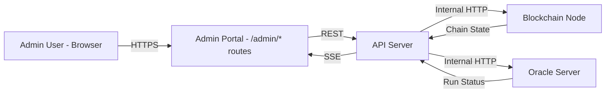

# Admin Portal — Component Specification

> **System:** WPM (Wampum) Prediction Market Platform
> **Owner:** Kevin (chain operator / sole admin)
> **Status:** Draft
> **Last updated:** 2026-03-06
> **Architecture doc:** [ARCHITECTURE.md](/Users/kevinpruett/code/wpm/ARCHITECTURE.md)

## 1. Overview

The Admin Portal is the administrative interface for the WPM chain operator. It provides full "god mode" control over the system: token distribution from treasury, market lifecycle management, user management, invite code generation, oracle oversight, and system health monitoring. It is a set of protected routes within the web app (`/admin/*`), authenticated separately from the standard user passkey flow. Only one admin exists (Kevin); multi-admin is out of scope.

## 2. Context

### System Context Diagram



### Assumptions

- There is exactly one admin user. The admin role is assigned at system initialization, not through a self-service flow.
- The admin portal is part of the same web app codebase, sharing the same build and deployment pipeline. It is not a separate application.
- All admin actions that modify chain state go through the API server, which submits transactions to the blockchain node. The portal never talks to the node directly.
- The API server already exposes all required admin endpoints (documented in `specs/api-server.md`). The portal is a frontend consumer of those endpoints.
- Oracle manual triggers are forwarded by the API server to the oracle container over the Docker internal network.

### Constraints

- **Single admin:** No RBAC beyond admin/non-admin. No permission granularity within the admin role.
- **Deployment:** Runs inside the `wpm-web` Docker container. No additional infrastructure.
- **Browser support:** Same as the main web app (modern browsers with WebAuthn support).
- **No offline mode:** Admin portal requires live connectivity to the API server. No service worker caching for admin routes.

### Out of Scope

- Multi-admin support, role hierarchy, or permission delegation.
- Direct database/chain file access or editing.
- Automated alerting or paging (admin checks dashboard manually).
- Custom market creation (future feature, not MVP).

## 3. Functional Requirements

### FR-1: Admin Authentication

**Description:** The admin portal must authenticate the admin separately from standard user passkey auth and reject all non-admin access.

**Trigger:** Admin navigates to any `/admin/*` route.

**Processing:**
1. Check for a valid JWT in the session with `role === "admin"`.
2. If no valid admin JWT exists, redirect to the admin login page (`/admin/login`).
3. Admin enters the static API key (stored in the `ADMIN_API_KEY` environment variable) on the login form (`/admin/login`).
4. API server validates the key and returns a JWT with `role: "admin"`.
5. JWT is stored in the browser and attached to all subsequent API requests as `Authorization: Bearer <token>`.

**Acceptance Criteria:**
- [ ] Given an unauthenticated user, when they navigate to `/admin`, then they are redirected to `/admin/login`
- [ ] Given a user with a standard (non-admin) JWT, when they navigate to `/admin`, then they see a 403 Forbidden page, not the admin dashboard
- [ ] Given the admin, when they enter valid credentials, then they receive a JWT with `role: "admin"` and are redirected to `/admin`
- [ ] Given the admin, when they enter invalid credentials, then they see an error message and are not authenticated
- [ ] Given an admin JWT that has expired, when any `/admin/*` page is loaded, then the admin is redirected to `/admin/login`

---

### FR-2: Dashboard

**Description:** At-a-glance system overview displaying key metrics across treasury, markets, users, oracle, and node health.

**Route:** `/admin`

**Trigger:** Admin navigates to the dashboard (default admin landing page).

**Processing:**
1. Fetch data from multiple API endpoints in parallel:
   - `GET /admin/treasury` -- treasury balance and supply breakdown
   - `GET /admin/health` -- node status, chain height, mempool, oracle last run, uptime
   - `GET /markets` -- derive active market count and total volume
   - `GET /admin/users` -- derive user count and recent signups
2. Render dashboard panels.

**Display Panels:**

| Panel | Data | Source Endpoint |
|-------|------|-----------------|
| Treasury Balance | Current balance, total supply breakdown (treasury / distributed / seeded in markets) | `GET /admin/treasury` |
| Active Markets | Count of open markets, total volume across all open markets | `GET /markets` |
| Users | Total user count, signups in the last 7 days | `GET /admin/users` |
| Oracle Status | Last ingest run timestamp, last resolve run timestamp, next scheduled run | `GET /admin/health` |
| Node Health | Chain height, mempool size, uptime | `GET /admin/health` |
| Recent Activity | Last 20 transactions across the system (type, participants, amount, timestamp) | `GET /wallet/transactions?limit=20` (admin-scoped) |

**Acceptance Criteria:**
- [ ] Given the admin is on the dashboard, when the page loads, then all six panels display current data
- [ ] Given the API server is unreachable, when the dashboard loads, then each panel shows an error state (not a blank or spinner forever)
- [ ] Given the oracle has not run in over 24 hours, when the dashboard loads, then the Oracle Status panel visually indicates a warning (e.g., amber text or icon)

---

### FR-3: Treasury Management

**Description:** View treasury state and distribute tokens to users.

**Route:** `/admin/treasury`

**Trigger:** Admin navigates to the treasury page or submits a distribution.

**Display:**
- Current treasury balance (prominent, top of page)
- Supply breakdown visualization:

| Category | Description |
|----------|-------------|
| Treasury (unallocated) | WPM held by the treasury wallet, not yet distributed |
| Distributed to users | Sum of all `Distribute` and signup airdrop transactions |
| Locked in active market pools | Sum of seed amounts for all open markets |
| Referral rewards paid | Sum of all `Referral` transactions |

- Distribution history table:

| Column | Type | Description |
|--------|------|-------------|
| Recipient | string | User name (linked to user detail) |
| Amount | number | WPM distributed |
| Reason | string | Free-form note entered by admin |
| Timestamp | datetime | When the distribution was processed |

**Distribute Tokens Form:**

| Field | Type | Validation |
|-------|------|------------|
| Recipient | searchable dropdown | Required. Must be an existing user. Search by name or wallet address. |
| Amount | number input | Required. Must be > 0. Must be <= current treasury balance. Must have at most 2 decimal places (0.01 WPM precision). |
| Reason | text input | Required. 1-200 characters. |

**Processing (distribute):**
1. Admin fills out form and clicks "Confirm".
2. A confirmation modal appears showing: recipient name, amount, reason, and the treasury balance after distribution.
3. On confirm, `POST /admin/distribute` with `{ recipient, amount, reason }`.
4. On success, update treasury balance display, prepend new row to distribution history.
5. On failure, show error message from API (e.g., `INSUFFICIENT_BALANCE`).

**Acceptance Criteria:**
- [ ] Given the treasury has 500,000 WPM, when the admin distributes 10,000 WPM to a user, then a `Distribute` transaction is submitted and the treasury balance decreases by 10,000
- [ ] Given the treasury has 100 WPM, when the admin attempts to distribute 200 WPM, then the form shows a validation error before submission
- [ ] Given the admin enters a negative amount, when they attempt to submit, then the form rejects the input
- [ ] Given a distribution succeeds, when the admin views the distribution history, then the new entry appears at the top

---

### FR-4: Market Management

**Description:** View, filter, and take administrative actions on all markets.

**Route:** `/admin/markets`

**Trigger:** Admin navigates to market management or takes an action on a market.

**Market List Table:**

| Column | Type | Sortable | Filterable |
|--------|------|----------|------------|
| Market ID | string (truncated, copyable) | No | No |
| Sport | string | Yes | Yes (dropdown: NFL, NBA, etc.) |
| Teams | string ("Away @ Home") | No | Yes (text search) |
| Status | enum | Yes | Yes (dropdown: open, resolved, cancelled) |
| Start Time | datetime | Yes (default sort) | Yes (date range) |
| Volume | number (WPM) | Yes | No |
| Seed Amount | number (WPM) | Yes | No |
| Created At | datetime | Yes | No |

**Per-Market Actions:**

#### FR-4a: View Market Detail

Opens a detail view showing:
- Full market info (all table columns, expanded)
- AMM pool state: `poolSharesA`, `poolSharesB`, current prices, k-value
- All share positions: table of users holding shares (user name, shares A, shares B, estimated value)
- Trade history: all `PlaceBet` and `SellShares` transactions for this market (user, outcome, amount, shares, price, timestamp)

#### FR-4b: Cancel Market

1. Admin clicks "Cancel" on a market row.
2. Confirmation modal appears with a required reason text field (1-500 characters).
3. On confirm, `POST /admin/markets/:marketId/cancel` with `{ reason }`.
4. Node processes `CancelMarket` transaction: refunds all bettors, treasury reclaims seed.
5. Market status updates to "cancelled" in the table.

**Preconditions:** Market status must be "open". Cannot cancel an already-resolved or already-cancelled market.

#### FR-4c: Manually Resolve Market

1. Admin clicks "Resolve" on a market row.
2. Modal appears with:
   - Winning outcome selector (radio: Outcome A / Outcome B)
   - Final score text input (free-form, e.g., "Chiefs 27, Eagles 24")
3. On confirm, `POST /admin/markets/:marketId/resolve` with `{ winningOutcome: "A" | "B", finalScore }`.
4. Node processes `ResolveMarket` transaction, triggers settlement engine.
5. Market status updates to "resolved".

**Preconditions:** Market status must be "open". Cannot resolve an already-resolved or already-cancelled market.

#### FR-4d: Override Seed Amount

1. Admin clicks "Override Seed" on a market row.
2. Modal with a number input for the new seed amount.
3. `POST /admin/markets/:marketId/seed` with `{ amount }`.
4. For future markets: updates the default seed configuration.
5. For existing open markets: adds additional liquidity to the pool.

**Acceptance Criteria:**
- [ ] Given an open market, when the admin cancels it with a reason, then all bettors receive full refunds and the treasury reclaims the seed
- [ ] Given an open market, when the admin manually resolves it with outcome A, then the settlement engine pays out all outcome-A share holders at 1.00 WPM per share
- [ ] Given a resolved market, when the admin attempts to cancel it, then the action is rejected with an appropriate error
- [ ] Given the market list has 50 markets, when the admin filters by status "open" and sport "NFL", then only matching markets are displayed

---

### FR-5: User Management

**Description:** View all users and perform per-user administrative actions.

**Route:** `/admin/users`

**User List Table:**

| Column | Type | Sortable | Filterable |
|--------|------|----------|------------|
| Name | string | Yes | Yes (text search) |
| Email | string | No | Yes (text search) |
| Wallet Address | string (truncated, copyable) | No | No |
| Balance | number (WPM) | Yes | No |
| Signup Date | datetime | Yes | Yes (date range) |
| Invited By | string (inviter name) | No | Yes (dropdown) |
| Status | enum (active) | No | No |

**Per-User Actions:**

#### FR-5a: View User Detail

Opens a detail view showing:
- Profile: name, email, wallet address, signup date, invited by
- Current balance
- Active positions: all open market positions (market, outcome, shares, estimated value)
- Transaction history: paginated list of all transactions involving this wallet
- Referral stats: invite code used, users they have referred, total referral rewards earned

#### FR-5b: Quick Distribute

Shortcut to FR-3's distribute form, pre-populated with this user as the recipient.

#### FR-5c: View Transactions

Filtered view of the transaction history for this user's wallet address. Same as FR-5a's transaction history but as a dedicated page with pagination and type filters.

**Acceptance Criteria:**
- [ ] Given 20 users exist, when the admin views the user list, then all 20 users appear with correct balances
- [ ] Given the admin views a user detail, when that user has 3 open positions, then all 3 positions are displayed with current estimated values
- [ ] Given the admin clicks "Distribute" on a user row, then the distribute form opens with that user pre-selected as the recipient

---

### FR-6: Invite Code Management

**Description:** Generate, view, and manage invite codes for user onboarding.

**Route:** `/admin/invites`

**Generate Codes Form:**

| Field | Type | Validation |
|-------|------|------------|
| Count | number input | Required. 1-50. |
| Max Uses | number input | Required. >= 1. How many times each code can be used before expiring. |
| Referrer | searchable dropdown (optional) | If set, the selected user receives 5,000 WPM referral reward when each code is redeemed. |

**Processing (generate):**
1. `POST /admin/invite-codes` with `{ count, maxUses, referrer? }`.
2. API returns `{ codes: string[] }`.
3. Display generated codes in a list with copy-to-clipboard buttons.

**Invite Code Table:**

| Column | Type | Sortable |
|--------|------|----------|
| Code | string (monospace, copyable) | No |
| Created At | datetime | Yes |
| Status | enum: active, fully-used, deactivated | Yes |
| Referrer | string (user name or "None") | Yes |
| Uses | string ("2 / 5" format) | No |
| Used By | list of user names | No |

**Per-Code Actions:**

| Action | Endpoint | Behavior |
|--------|----------|----------|
| Deactivate | `DELETE /admin/invite-codes/:code` | Sets status to "deactivated". Code can no longer be used for signup. |
| Copy Code | (client-side) | Copies code string to clipboard. Shows brief "Copied" toast. |
| Copy Share Link | (client-side) | Copies `https://wpm.example.com/join?code=ABC123` to clipboard. Shows brief "Copied" toast. |

**Acceptance Criteria:**
- [ ] Given the admin generates 5 codes with max 3 uses each, when the generation succeeds, then 5 unique codes are returned and displayed
- [ ] Given a code with 3/3 uses, when a new user attempts signup with that code, then the API rejects it with `INVALID_INVITE_CODE`
- [ ] Given an active code, when the admin deactivates it, then the code status changes to "deactivated" and it cannot be used for signup
- [ ] Given a code linked to a referrer, when a new user signs up with that code, then the referrer receives 5,000 WPM via a `Referral` transaction
- [ ] Given the admin clicks "Copy Share Link", then the clipboard contains `https://wpm.example.com/join?code=<CODE>`

---

### FR-7: Oracle Control

**Description:** Monitor and manually control the oracle server's ingest and resolve jobs.

**Route:** `/admin/oracle`

**Display:**

| Section | Data | Source |
|---------|------|--------|
| Schedule | Ingest: daily 6:00 AM ET. Resolve: every 30 min, 12:00 PM - 1:00 AM ET. | Static (matches architecture doc) |
| Last Run | Timestamps for last ingest and last resolve | `GET /admin/oracle/status` |
| Next Scheduled Run | Computed from schedule and current time | Client-side calculation |
| Run History | Table of recent runs (see below) | `GET /admin/oracle/history` |
| Enabled Sports | Toggle list per sport (NFL, NBA, NHL, MLB, etc.) | `GET /admin/oracle/status` |
| ESPN Connectivity | Test button and last-check result | `POST /admin/oracle/espn-test` |

**Run History Table:**

| Column | Type |
|--------|------|
| Job Type | "ingest" or "resolve" |
| Started At | datetime |
| Duration | seconds |
| Status | "success", "partial", "failure" |
| Games Processed | number |
| Markets Created | number (ingest only) |
| Markets Resolved | number (resolve only) |
| Errors | expandable error messages (if any) |

**Manual Trigger Buttons:**

Trigger requests are forwarded by the API server to the oracle's internal HTTP endpoint (port 3001). The oracle is the single source of truth for all ESPN parsing and market logic.

| Button | Endpoint | Behavior |
|--------|----------|----------|
| "Run Ingest Now" | `POST /admin/oracle/ingest` | Triggers an immediate ingest job. Button shows a spinner until the job completes. Response includes summary (games found, markets created). |
| "Run Resolve Now" | `POST /admin/oracle/resolve` | Triggers an immediate resolve job. Button shows a spinner until the job completes. Response includes summary (games checked, markets resolved). |

**Enabled Sports Toggles:**
- Each sport has an on/off toggle.
- Toggling a sport sends a config update to the oracle.
- Only enabled sports are queried during ingest.
- NFL is enabled by default at launch; others are disabled.

**ESPN Connectivity Test:**
- "Test ESPN Connection" button sends a lightweight request to ESPN's API through the oracle.
- Displays result: "Connected" (green) with response time, or "Failed" (red) with error message.

**Acceptance Criteria:**
- [ ] Given the admin clicks "Run Ingest Now", when 3 upcoming NFL games exist on ESPN, then 3 new markets are created and the run appears in history with status "success"
- [ ] Given the admin clicks "Run Resolve Now", when 2 games have final scores, then 2 markets are resolved and settlements are triggered
- [ ] Given the admin clicks "Run Ingest Now" while an ingest is already running, then the button is disabled and shows "Running..."
- [ ] Given ESPN is unreachable, when the admin clicks "Test ESPN Connection", then the result shows "Failed" with the error details
- [ ] Given the admin disables NBA, when the next ingest runs, then no NBA games are fetched

---

### FR-8: System Health

**Description:** Monitor blockchain node status, chain statistics, mempool, and service logs.

**Route:** `/admin/system`

**Display Sections:**

#### Node Status

| Metric | Type | Source |
|--------|------|--------|
| Status | "running" / "stopped" | `GET /admin/health` |
| Uptime | duration (e.g., "3d 14h 22m") | `GET /admin/health` |
| Memory Usage | MB (current / limit if available) | `GET /admin/health` |

#### Chain Statistics

| Metric | Type |
|--------|------|
| Block Height | number |
| Total Transactions | number |
| Total Blocks | number |
| Chain File Size | bytes (human-readable, e.g., "14.2 MB") |

#### Mempool

| Metric | Type |
|--------|------|
| Current Size | number of pending transactions |
| Pending Transactions | expandable list with transaction type and submitter |

#### Service Logs

**Endpoint:** `GET /admin/system/logs/:service?lines=100`

| Service | Container |
|---------|-----------|
| node | `wpm-node` |
| api | `wpm-api` |
| oracle | `wpm-oracle` |

- Tab interface: one tab per service.
- Each tab shows the last 100 log lines in a scrollable, monospace-font container.
- "Refresh" button to re-fetch logs.
- Auto-scroll to bottom on load.

**Acceptance Criteria:**
- [ ] Given the node is running, when the admin views system health, then status shows "running" with correct uptime
- [ ] Given 150 blocks have been produced, when the admin views chain stats, then block height shows 150
- [ ] Given 3 transactions are in the mempool, when the admin views the mempool section, then all 3 are listed with their types
- [ ] Given the admin selects the "oracle" log tab, when logs are fetched, then the last 100 lines from the oracle container are displayed

---

### FR-9: Admin Audit Trail

**Description:** All admin actions are logged and visible in the dashboard activity feed.

**Processing:**
- Every mutating admin action (distribute, cancel market, resolve market, generate invite codes, deactivate invite code, trigger oracle, toggle sport) is recorded with:
  - Action type
  - Timestamp
  - Parameters (e.g., market ID, amount, recipient)
  - Result (success or failure with error)
- These entries appear in the Dashboard's Recent Activity panel (FR-2).
- On-chain actions (distribute, cancel, resolve) are inherently recorded as blockchain transactions.
- Off-chain actions (trigger oracle, toggle sport) are logged by the API server.

**Acceptance Criteria:**
- [ ] Given the admin distributes tokens, when they view the dashboard, then the distribution appears in the recent activity feed
- [ ] Given the admin triggers a manual oracle ingest, when they view the dashboard, then the trigger event appears in the activity feed

## 4. Non-Functional Requirements

### Performance

| Metric | Target | Rationale |
|--------|--------|-----------|
| Dashboard load time | < 2 seconds | Admin should get a quick overview without waiting |
| Table rendering (up to 200 rows) | < 500ms | Largest expected dataset: ~200 markets per season |
| API response for admin endpoints | < 1 second p99 | Single admin user, no high-concurrency concern |
| Log fetch | < 3 seconds for 100 lines | Acceptable for debugging workflow |

### Reliability

- **Availability:** Same as the web app. No separate SLA. If the web app is up, the admin portal is up.
- **Failure handling:** All API calls use a standard error handler that displays the API's error message in a toast or inline alert. No silent failures.
- **Data freshness:** Dashboard data is fetched on page load and on manual refresh. No automatic polling (SSE covers real-time price updates for markets, but dashboard panels are fetched on-demand).

### Security

| Concern | Approach |
|---------|----------|
| Authentication | Separate admin JWT. `role: "admin"` claim checked on every `/admin/*` API call. |
| Authorization | Binary: admin or not-admin. No granular permissions. |
| Route protection | Client-side route guard redirects non-admin to `/admin/login`. Server-side middleware rejects requests without admin JWT. Both layers required. |
| Transport | HTTPS enforced via nginx TLS termination. |
| Admin credential storage | Static API key in `ADMIN_API_KEY` environment variable. Never in client code or version control. |
| Sensitive actions | Confirmation modals for all destructive actions (cancel market, resolve market, deactivate invite code). |
| Session expiry | Admin JWT expires after 24 hours (shorter than user JWT's 7-day expiry). |

### Scalability

Not a primary concern. Single admin user, small friend group (~20-50 users), limited number of markets per season. The admin portal does not need to handle concurrent admin sessions or high request volumes.

## 5. Interface Definitions

### Inbound Interfaces

The admin portal is a frontend application. Its "inbound interface" is the admin user interacting via a browser. All data flows through the API server's admin endpoints.

### Outbound Interfaces (API Calls)

All calls include `Authorization: Bearer <admin-jwt>`. All responses follow the standard error format from `specs/api-server.md`.

#### Treasury

```
GET /admin/treasury
Response: {
  balance: number,
  totalDistributed: number,
  totalSeeded: number,
  totalReclaimed: number
}

POST /admin/distribute
Request:  { recipient: string, amount: number, reason: string }
Response: { transaction: Transaction }
```

#### Markets (Admin Actions)

```
POST /admin/markets/:marketId/cancel
Request:  { reason: string }
Response: { transaction: Transaction }

POST /admin/markets/:marketId/resolve
Request:  { winningOutcome: "A" | "B", finalScore: string }
Response: { transaction: Transaction }

POST /admin/markets/:marketId/seed
Request:  { amount: number }
Response: { transaction: Transaction }
```

#### Invite Codes

```
POST /admin/invite-codes
Request:  { count: number, maxUses: number, referrer?: string }
Response: { codes: string[] }

GET /admin/invite-codes
Response: { codes: InviteCode[] }

DELETE /admin/invite-codes/:code
Response: { success: boolean }
```

```typescript
interface InviteCode {
  code: string;
  createdAt: number;
  status: "active" | "fully-used" | "deactivated";
  referrer: string | null;      // userId of the referrer, or null
  referrerName: string | null;  // display name of the referrer
  useCount: number;
  maxUses: number;
  usedBy: { userId: string; name: string; usedAt: number }[];
}
```

#### Oracle

```
POST /admin/oracle/ingest
Response: { jobId: string, gamesFound: number, marketsCreated: number, errors: string[] }

POST /admin/oracle/resolve
Response: { jobId: string, gamesChecked: number, marketsResolved: number, errors: string[] }

GET /admin/oracle/status
Response: {
  lastIngestRun: number | null,
  lastResolveRun: number | null,
  nextIngestRun: number,
  nextResolveRun: number,
  enabledSports: { sport: string, enabled: boolean }[]
}

GET /admin/oracle/history
Response: {
  runs: OracleRun[]
}
```

```typescript
interface OracleRun {
  jobId: string;
  type: "ingest" | "resolve";
  startedAt: number;
  durationMs: number;
  status: "success" | "partial" | "failure";
  gamesProcessed: number;
  marketsCreated: number;   // ingest only
  marketsResolved: number;  // resolve only
  errors: string[];
}
```

#### System Health

```
GET /admin/health
Response: {
  nodeStatus: "running" | "stopped",
  chainHeight: number,
  totalTransactions: number,
  totalBlocks: number,
  chainFileSize: number,
  mempoolSize: number,
  mempoolTransactions: { type: string, submitter: string }[],
  uptime: number,
  memoryUsage: number,
  oracleLastIngest: number | null,
  oracleLastResolve: number | null
}

GET /admin/system/logs/:service?lines=100
Response: {
  service: "node" | "api" | "oracle",
  lines: string[],
  timestamp: number
}
```

#### Users (Admin-Scoped)

```
GET /admin/users
Response: { users: AdminUserProfile[] }
```

```typescript
interface AdminUserProfile {
  userId: string;
  name: string;
  email: string;
  walletAddress: string;
  balance: number;
  signupDate: number;
  invitedBy: { userId: string; name: string } | null;
  status: "active";
  referralCount: number;
  totalReferralRewards: number;
}
```

## 6. Error Handling

| Error Scenario | Detection | User-Facing Response | Recovery |
|---------------|-----------|---------------------|----------|
| Admin JWT expired | 401 response from API | Redirect to `/admin/login` with "Session expired" message | Re-authenticate |
| API server unreachable | Network error / timeout | Toast: "Unable to reach server. Check connectivity." | Manual retry via refresh or retry button |
| Distribute exceeds treasury balance | 400 `INSUFFICIENT_BALANCE` | Inline error on form: "Treasury balance insufficient. Available: X WPM" | Admin adjusts amount |
| Cancel/resolve on invalid market state | 400 `MARKET_ALREADY_RESOLVED` or `MARKET_ALREADY_CANCELLED` | Modal error: "This market has already been [resolved/cancelled]" | Refresh market list to see current state |
| Oracle trigger while job is running | 409 or custom error | Button remains disabled, toast: "Job already in progress" | Wait for current job to complete |
| ESPN unreachable during connectivity test | Oracle returns failure | Display "ESPN unreachable" with error detail | Retry later |
| Invalid invite code parameters | 400 `INVALID_AMOUNT` | Inline form validation error | Admin corrects input |
| Log fetch fails (container not found) | 404 or 500 | Tab shows "Logs unavailable for this service" | Check if container is running via System Health |

### Idempotency

- **Token distribution:** Not idempotent. Each submission creates a new `Distribute` transaction. The confirmation modal serves as the guard against accidental double-submission. The "Confirm" button is disabled after click until the response returns.
- **Market cancel/resolve:** Idempotent in effect. Attempting to cancel an already-cancelled market returns an error but causes no state change. Same for resolving an already-resolved market.
- **Invite code generation:** Not idempotent. Each call generates new codes. The generate button is disabled during the request.
- **Oracle triggers:** Not idempotent. Each trigger runs the job. Concurrent triggers are rejected by the oracle (only one job of each type runs at a time).

## 7. Observability

### Key Metrics

| Metric | Type | Description | Alert Threshold |
|--------|------|-------------|-----------------|
| `admin.login.count` | counter | Admin login attempts (success/failure) | > 5 failures in 10 minutes (potential brute force) |
| `admin.distribute.total_wpm` | counter | Total WPM distributed via admin portal | N/A (informational) |
| `admin.market.cancel.count` | counter | Markets cancelled by admin | N/A |
| `admin.market.manual_resolve.count` | counter | Markets manually resolved by admin | N/A |
| `admin.oracle.manual_trigger.count` | counter | Manual oracle triggers | N/A |

### Logging

- All admin API requests are logged with: timestamp, action, admin userId, parameters, result (success/error).
- Log level: INFO for successful actions, WARN for rejected actions (e.g., insufficient balance), ERROR for unexpected failures.
- Logs are structured JSON for parseability.

## 8. UI / UX Guidelines

- **Layout:** Sidebar navigation with links to each section (Dashboard, Treasury, Markets, Users, Invites, Oracle, System). Collapsible on mobile.
- **Confirmation modals:** Required for all destructive or high-impact actions: distribute tokens, cancel market, resolve market, deactivate invite code. Modals display a summary of the action and require an explicit "Confirm" click.
- **Loading states:** Skeleton loaders for tables and panels during initial fetch. Spinner on buttons during async operations.
- **Error states:** Inline errors for form validation. Toast notifications for API errors. Full-page error state if the API is completely unreachable.
- **Empty states:** Helpful messages when tables are empty (e.g., "No markets found matching your filters").
- **Responsive:** Functional on mobile but optimized for desktop (admin is expected to use a laptop/desktop primarily).

## 9. Validation & Acceptance Criteria

### Critical Path Tests

These scenarios must pass for the admin portal to be considered functional:

1. **Admin login and access control:** Admin can log in and access all `/admin/*` routes. Non-admin users are rejected.
2. **Token distribution end-to-end:** Admin distributes WPM to a user. User's balance increases. Treasury balance decreases. Transaction appears on-chain.
3. **Market cancellation end-to-end:** Admin cancels an open market. All bettors are refunded. Treasury reclaims seed. Market status is "cancelled".
4. **Manual market resolution end-to-end:** Admin resolves a market. Settlement engine pays out winners. Losing shares pay 0. Market status is "resolved".
5. **Invite code lifecycle:** Admin generates codes. User signs up with a code. Code use count increments. Admin deactivates a code. Code can no longer be used.
6. **Oracle manual trigger:** Admin triggers ingest. New markets appear. Admin triggers resolve. Completed games are settled.
7. **System health accuracy:** Dashboard and system health page show data consistent with actual node state (verified by comparing with direct node queries).

### Integration Checkpoints

- [ ] Admin portal successfully authenticates against the API server and receives an admin JWT
- [ ] All admin API endpoints return expected response shapes (validate against interface definitions above)
- [ ] SSE stream delivers real-time updates to the admin dashboard (market created, price updates)
- [ ] Oracle manual triggers complete within 30 seconds and return accurate summaries
- [ ] Log viewer displays actual container logs (verified by comparing with `docker logs` output)

### Rollout Strategy

1. Deploy as part of the web app container (`wpm-web`). No separate deployment.
2. Admin routes are hidden from the main navigation (no link in the user-facing app).
3. Initial smoke test: admin logs in, views dashboard, distributes a small amount of WPM, generates an invite code.
4. No feature flags needed (single admin, private platform).

## 10. Resolved Questions

| # | Question | Resolution |
|---|----------|------------|
| 1 | Which admin auth mechanism to use: static API key or dedicated passkey? | **Resolved:** Static API key stored in `ADMIN_API_KEY` environment variable. Admin enters the key on `/admin/login`, API validates it and returns a JWT with `role: "admin"`. |
| 2 | Should the admin portal auto-refresh dashboard data on a timer, or only on manual refresh? | **Resolved:** Start with manual refresh. |
| 3 | Should Docker container status be exposed via the health endpoint? | **Resolved:** Deferred. Omit container status if not feasible. |
| 4 | What is the format and length of generated invite codes? | **Resolved:** `WPM-` prefix + 6 uppercase alphanumeric characters (e.g., `WPM-A3K9B2`). |

## Appendix

### Glossary

| Term | Definition |
|------|------------|
| Treasury | The system wallet that holds undistributed WPM. Source of all token distribution and market seeding. |
| Seed / Seeding | Initial liquidity added to a market's AMM pool from the treasury at market creation. Default: 1,000 WPM. |
| Distribute | Admin action to send WPM from treasury to a user's wallet. |
| Oracle | The automated service that creates markets from ESPN data and resolves them with final scores. |
| Ingest | Oracle job that fetches upcoming games and creates markets. |
| Resolve | Oracle job that checks completed games and submits resolution transactions. |
| Settlement | The process of paying out winning share holders after a market is resolved. |

### References

- [Architecture Doc](../ARCHITECTURE.md)
- [API Server Spec](./api-server.md) -- Admin endpoint definitions
- [Oracle Server Spec](./oracle-server.md) -- Oracle job details and schedule
- [Web App Spec](./web-app.md) -- User-facing app (shares codebase with admin portal)
