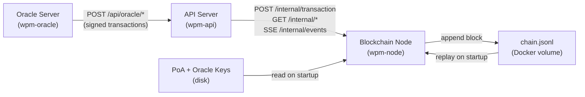
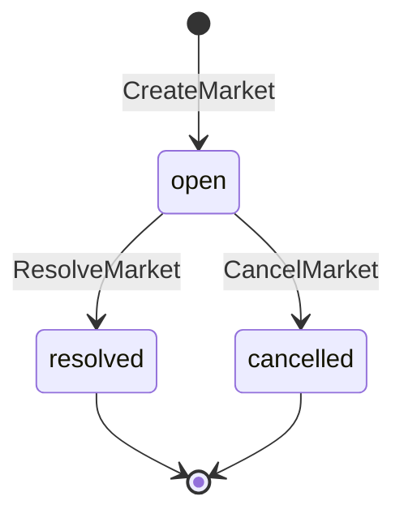

# Blockchain Node -- Component Specification

> **System:** WPM (Wampum) Prediction Market Platform
> **Status:** Draft
> **Last updated:** 2026-03-06
> **Architecture doc:** [ARCHITECTURE.md](/ARCHITECTURE.md)

---

## 1. Overview

The blockchain node is the single source of truth for the WPM platform. It holds the entire chain in memory, persists it to an append-only JSONL file on disk, validates and processes all transactions, produces blocks via Proof of Authority (single static signer), manages the mempool, maintains AMM pool state for all prediction markets, and runs the settlement engine when markets resolve or cancel. It exposes an internal HTTP API consumed exclusively by the API server over Docker's internal network.

---

## 2. Context

> **The oracle never contacts the node directly.** All oracle transactions are submitted to the API server, which forwards them via `POST /internal/transaction`. The node only validates cryptographic signatures -- it is agnostic to a transaction's network origin.

### Assumptions

- **Single-node deployment.** One instance, no replication, no multi-node consensus.
- **Trusted internal network.** API server and node communicate over Docker's internal network. No auth or encryption on the internal API.
- **Wall-clock time is authoritative.** NTP must be configured; clock skew causes incorrect market cutoff behavior.
- **Small user base (~10-50 users).** Data structures are not optimized for scale.
- **Single-threaded event loop.** No concurrent block production or locking concerns.

### Constraints

| Constraint                                                  | Source                  |
| ----------------------------------------------------------- | ----------------------- |
| TypeScript / Node.js runtime (`tsx`)                        | Project tech stack      |
| RSA 2048-bit key pairs via Node `crypto`                    | Project tech stack      |
| SHA-256 for all hashing                                     | Project tech stack      |
| Docker container (`wpm-node`)                               | Deployment architecture |
| JSONL on Docker volume for persistence                      | Deployment architecture |
| No external database                                        | Architecture decision   |
| Fixed total supply: 10,000,000.00 WPM                       | Token economics         |
| 2-decimal precision for all WPM amounts (banker's rounding) | Token economics         |

---

## 3. Functional Requirements

### FR-1: Genesis Block Production

On first startup (no existing `chain.jsonl`), the node produces a genesis block that mints the entire token supply to the treasury.

- Block with `index: 0`, `previousHash: "0"`.
- Single `Distribute` transaction: 10,000,000.00 WPM to treasury, `reason: "genesis"`.
- Hash: `SHA-256(index + timestamp + previousHash + JSON.stringify(transactions))`.
- Signed with the PoA private key, written to `chain.jsonl`.

---

### FR-2: JSONL Persistence and Startup Replay

**Write:** Each produced block is serialized as a single JSON line and appended to `chain.jsonl` using synchronous writes to ensure durability before the block is considered committed.

**Replay:** On startup, read `chain.jsonl` line by line, validate each block against the previous (FR-4), and replay every transaction to rebuild `ChainState`. If any block fails validation, halt with an error identifying the block index and reason. The mempool is not persisted -- it starts empty.

---

### FR-3: Block Production

A polling loop checks the mempool every 1 second. When pending transactions exist:

1. Take up to 100 transactions from the front (FIFO).
2. Re-validate each against **current state at point of inclusion** (not mempool-entry state). Discard any that are now invalid -- do not re-queue.
3. If no valid transactions remain, produce no block.
4. Construct block: increment index, `timestamp = Date.now()`, set `previousHash`, include valid transactions.
5. Compute hash, sign with PoA key, append to `chain.jsonl`, apply to in-memory state.
6. Emit `block` event on SSE stream.

---

### FR-4: Block Validation

Every block (replayed or freshly produced) must satisfy:

1. `index === previousBlock.index + 1` (genesis: `index === 0`).
2. `previousHash === previousBlock.hash` (genesis: `previousHash === "0"`).
3. `hash === SHA-256(index + timestamp + previousHash + JSON.stringify(transactions))`.
4. `signature` is valid RSA signature of `hash` using the PoA public key.
5. All transactions are individually valid per their type-specific rules.
6. No double-spend within a block -- running balances are tracked incrementally as each transaction is validated.

---

### FR-5: Transaction -- Transfer

Move WPM tokens between user wallets.

**Fields:** `type: "Transfer"`, `recipient` (public key), `amount` (2-decimal WPM).

**Validation:**

| Rule                          | Error Code             |
| ----------------------------- | ---------------------- |
| `amount > 0`                  | `INVALID_AMOUNT`       |
| At most 2 decimal places      | `INVALID_PRECISION`    |
| `sender !== recipient`        | `SELF_TRANSFER`        |
| `balances[sender] >= amount`  | `INSUFFICIENT_BALANCE` |
| Valid RSA signature by sender | `INVALID_SIGNATURE`    |

**State:** `balances[sender] -= amount`, `balances[recipient] += amount`.

---

### FR-6: Transaction -- Distribute

Treasury distributes tokens to a user. Used for signup airdrops, referral rewards, and manual admin grants. Separate from Transfer for auditability.

**Fields:** `type: "Distribute"`, `recipient`, `amount`, `reason` (`"signup_airdrop" | "referral_reward" | "manual"`).

**Validation:**

| Rule                                  | Error Code              |
| ------------------------------------- | ----------------------- |
| `sender` is treasury                  | `UNAUTHORIZED_SENDER`   |
| `amount > 0`                          | `INVALID_AMOUNT`        |
| At most 2 decimal places              | `INVALID_PRECISION`     |
| `balances[treasury] >= amount`        | `INSUFFICIENT_TREASURY` |
| `reason` is one of the allowed values | `INVALID_REASON`        |
| Valid PoA signer signature            | `INVALID_SIGNATURE`     |

**State:** `balances[treasury] -= amount`, `balances[recipient] += amount`.

---

### FR-7: Transaction -- CreateMarket

Oracle creates a new binary prediction market with AMM liquidity seeded from the treasury.

**Fields:** `type: "CreateMarket"`, `marketId` (UUID v4), `sport`, `homeTeam`, `awayTeam`, `outcomeA`, `outcomeB`, `eventStartTime` (Unix ms -- betting closes here), `seedAmount` (total WPM from treasury), `externalEventId` (ESPN event ID).

**Validation:**

| Rule                                                              | Error Code                           |
| ----------------------------------------------------------------- | ------------------------------------ |
| `sender` is oracle public key                                     | `UNAUTHORIZED_ORACLE`                |
| `marketId` not already in `markets`                               | `DUPLICATE_MARKET`                   |
| `externalEventId` not already used                                | `DUPLICATE_EVENT`                    |
| `eventStartTime > currentTimestamp`                               | `EVENT_IN_PAST`                      |
| `seedAmount > 0`, at most 2 decimal places                        | `INVALID_SEED` / `INVALID_PRECISION` |
| `balances[treasury] >= seedAmount`                                | `INSUFFICIENT_TREASURY`              |
| `sport`, `homeTeam`, `awayTeam`, `outcomeA`, `outcomeB` non-empty | `MISSING_FIELD`                      |
| Valid oracle signature                                            | `INVALID_SIGNATURE`                  |

**State:**

- `balances[treasury] -= seedAmount`
- Create `Market` with status `"open"`, `createdAt = timestamp`
- Create `AMMPool`: `sharesA = seedAmount / 2`, `sharesB = seedAmount / 2`, `k = sharesA * sharesB`, `wpmLocked = seedAmount`
- Record treasury LP position, add `externalEventId -> marketId` index

---

### FR-8: Transaction -- PlaceBet

User buys outcome shares from a market's AMM pool using WPM tokens.

**Fields:** `type: "PlaceBet"`, `marketId`, `outcome` (`"A" | "B"`), `amount` (WPM to spend).

**Validation:**

| Rule                                | Error Code             |
| ----------------------------------- | ---------------------- |
| Market exists                       | `MARKET_NOT_FOUND`     |
| Market status is `"open"`           | `MARKET_NOT_OPEN`      |
| `currentTimestamp < eventStartTime` | `BETTING_CLOSED`       |
| `amount > 0`                        | `INVALID_AMOUNT`       |
| `amount >= 1.00`                    | `MINIMUM_BET`          |
| At most 2 decimal places            | `INVALID_PRECISION`    |
| `balances[sender] >= amount`        | `INSUFFICIENT_BALANCE` |
| Valid sender signature              | `INVALID_SIGNATURE`    |

**AMM Buy (two-step mint-then-swap, constant product):**

The buy uses a two-step model: (1) mint complete share pairs, (2) swap the unwanted side for the wanted side. Example for buying outcome A:

1. `fee = amount * 0.01`, `netAmount = amount - fee`
2. **Mint** `netAmount` complete pairs into pool: `poolA += netAmount`, `poolB += netAmount`
3. **Swap** -- user sells `netAmount` B-shares back: `poolB_afterSwap = poolB + netAmount`, `poolA_final = (poolA * poolB) / poolB_afterSwap`, `additionalAShares = poolA - poolA_final`
4. `sharesToUser = netAmount + additionalAShares`
5. Update pool: `sharesA = poolA_final`, `sharesB = poolB_afterSwap`
6. Distribute fee: `sharesA += fee/2`, `sharesB += fee/2`
7. `pool.k = sharesA * sharesB`, `pool.wpmLocked += amount`

**State:** `balances[sender] -= amount`, `sharePositions[sender][marketId][outcome] += sharesToUser`, `costBasis += amount`.

---

### FR-9: Transaction -- SellShares

User sells outcome shares back to the AMM pool, receiving WPM tokens.

**Fields:** `type: "SellShares"`, `marketId`, `outcome` (`"A" | "B"`), `shareAmount`.

**Validation:**

| Rule                                        | Error Code            |
| ------------------------------------------- | --------------------- |
| Market exists                               | `MARKET_NOT_FOUND`    |
| Market status is `"open"`                   | `MARKET_NOT_OPEN`     |
| `currentTimestamp < eventStartTime`         | `BETTING_CLOSED`      |
| `shareAmount > 0`                           | `INVALID_AMOUNT`      |
| `shareAmount >= 0.01`                       | `MINIMUM_SELL`        |
| User holds `>= shareAmount` of that outcome | `INSUFFICIENT_SHARES` |
| Valid sender signature                      | `INVALID_SIGNATURE`   |

**AMM Sell (constant product):**

1. `newSharesA = pool.sharesA + shareAmount` (selling A example)
2. `sharesToRemove = pool.sharesB - (pool.sharesA * pool.sharesB) / newSharesA`
3. `wpmToReturn = sharesToRemove`, `fee = wpmToReturn * 0.01`, `netReturn = wpmToReturn - fee`
4. Update pool: `sharesA = newSharesA`, `sharesB = pool.sharesB - sharesToRemove + fee`
5. `pool.k = sharesA * sharesB`, `pool.wpmLocked -= netReturn`

**State:** `sharePositions[sender][marketId][outcome] -= shareAmount`, `balances[sender] += netReturn`. Cost basis reduced proportionally: `costBasisReduction = costBasis * (shareAmount / previousShareCount)`.

---

### FR-10: Transaction -- ResolveMarket

Oracle submits the final result for a completed event, triggering settlement.

**Fields:** `type: "ResolveMarket"`, `marketId`, `winningOutcome` (`"A" | "B"`), `finalScore` (e.g. "Chiefs 27, Eagles 24").

**Validation:**

| Rule                                 | Error Code            |
| ------------------------------------ | --------------------- |
| `sender` is oracle public key        | `UNAUTHORIZED_ORACLE` |
| Market exists                        | `MARKET_NOT_FOUND`    |
| Market status is `"open"`            | `MARKET_NOT_OPEN`     |
| `currentTimestamp >= eventStartTime` | `EVENT_NOT_STARTED`   |
| Valid oracle signature               | `INVALID_SIGNATURE`   |

**Settlement (inline, same block):**

1. Set market status to `"resolved"`, record `winningOutcome`, `finalScore`, `resolvedAt`.
2. For each address holding winning shares: generate `SettlePayout` with `amount = winningShares * 1.00` (banker's rounded to 2 decimals), `payoutType = "winnings"`. Losing shares pay 0 -- no payout generated.
3. Treasury receives the remainder: `treasuryReturn = pool.wpmLocked - sum(winner payouts)`, `payoutType = "liquidity_return"`. This includes the original seed plus accumulated trading fees.
4. All `SettlePayout` transactions included in the same block as `ResolveMarket`.
5. Clear AMM pool and all share positions for this market.

**Conservation:** `sum(winner payouts) + treasury liquidity return === pool.wpmLocked`.

---

### FR-11: Transaction -- CancelMarket

Oracle or admin cancels a market, triggering full refunds based on cost basis.

**Fields:** `type: "CancelMarket"`, `marketId`, `reason`.

**Validation:**

| Rule                             | Error Code            |
| -------------------------------- | --------------------- |
| `sender` is oracle or PoA signer | `UNAUTHORIZED_SENDER` |
| Market exists                    | `MARKET_NOT_FOUND`    |
| Market status is `"open"`        | `MARKET_NOT_OPEN`     |
| Valid signature                  | `INVALID_SIGNATURE`   |

**Settlement (refund mode, same block):**

1. Set market status to `"cancelled"`, record `resolvedAt`.
2. Refund each user their tracked `costBasis` (adjusted for partial sells) via `SettlePayout`. Skip zero-amount payouts.
3. Treasury receives: `pool.wpmLocked - sum(user costBasis refunds)` via `SettlePayout` with `payoutType = "liquidity_return"`.
4. Clear all share positions and AMM pool.

**Conservation:** `sum(user refunds) + treasury liquidity return === pool.wpmLocked`.

---

### FR-12: Transaction -- SettlePayout

System-generated transaction that distributes WPM after resolution or cancellation. **Not user-submittable** -- rejected with `SYSTEM_TX_ONLY` if received via HTTP API.

**Fields:** `type: "SettlePayout"`, `marketId`, `recipient`, `amount`, `payoutType` (`"winnings" | "liquidity_return"`).

**Validation:** `sender` must be PoA signer, market must be `"resolved"` or `"cancelled"`, `amount >= 0`. Zero-amount payouts are never generated.

**State:** `balances[recipient] += amount`.

---

### FR-13: Transaction -- Referral

System-generated reward (5,000 WPM) when an invited user completes signup. Generated internally when the API server calls `POST /internal/referral-reward`. **Not user-submittable** -- rejected with `SYSTEM_TX_ONLY` if received via `POST /internal/transaction`.

**Fields:** `type: "Referral"`, `recipient` (inviter's public key), `amount` (5,000.00 WPM), `referredUser` (new user's public key).

Invite code validation (existence, ownership, active status) is performed by the **API server** (SQLite), not the node.

**Node Validation:**

| Rule                                      | Error Code              |
| ----------------------------------------- | ----------------------- |
| `sender` is PoA signer / treasury         | `UNAUTHORIZED_SENDER`   |
| `balances[treasury] >= amount`            | `INSUFFICIENT_TREASURY` |
| `referredUser` not in `referredUsers` set | `DUPLICATE_REFERRAL`    |
| Not received via external submission      | `SYSTEM_TX_ONLY`        |
| Valid PoA signature                       | `INVALID_SIGNATURE`     |

**State:** `balances[treasury] -= amount`, `balances[recipient] += amount`, `referredUsers.add(referredUser)`.

---

### FR-14: Mempool Management

The mempool is an ordered FIFO queue of validated transactions awaiting block inclusion.

- Transactions arrive via `POST /internal/transaction`.
- Validated against **current state** before acceptance. Invalid transactions rejected immediately (HTTP 400 with error code).
- Reject transactions with `timestamp` more than 5 minutes (300,000 ms) from wall-clock time (`TIMESTAMP_OUT_OF_RANGE`).
- Duplicate transaction IDs rejected (`DUPLICATE_TX`) -- checked against both the mempool and `committedTxIds` set.
- Maximum 1,000 pending transactions. If full, reject with `MEMPOOL_FULL`.
- Not persisted -- empty on restart.
- Transactions valid at entry may become invalid by block time; FR-3 handles this.

---

### FR-15: Internal HTTP API

Exposed on a configurable port (default: 3001), all paths prefixed with `/internal`. No authentication (Docker network is the trust boundary).

#### Endpoints

| Method | Path                              | Description                                                  | Response                                             |
| ------ | --------------------------------- | ------------------------------------------------------------ | ---------------------------------------------------- |
| `POST` | `/internal/transaction`           | Submit transaction to mempool                                | `202 { txId }` or `400 { error, message }`           |
| `GET`  | `/internal/health`                | Health check                                                 | `200 { status, blockHeight, mempoolSize, uptimeMs }` |
| `GET`  | `/internal/state`                 | Full chain state snapshot                                    | `200 { blockHeight, balances, markets, pools }`      |
| `GET`  | `/internal/block/:index`          | Specific block by index                                      | `200 Block` or `404`                                 |
| `GET`  | `/internal/market/:id`            | Market detail with pool and positions                        | `200 { market, pool, positions }` or `404`           |
| `GET`  | `/internal/balance/:address`      | Balance for address (0 for unknown)                          | `200 { address, balance }`                           |
| `GET`  | `/internal/shares/:address`       | All share positions for address                              | `200 { address, positions }`                         |
| `GET`  | `/internal/blocks?from=N&limit=M` | Paginated block list (default `from=0`, `limit=50`, max 100) | `200 Block[]`                                        |
| `POST` | `/internal/distribute`            | System-generated distribute                                  | `202 { txId }` or `400`                              |
| `POST` | `/internal/referral-reward`       | System-generated referral reward                             | `202 { txId }` or `400`                              |
| `SSE`  | `/internal/events`                | Real-time event stream                                       | SSE stream                                           |

#### System Transaction Endpoints

**`POST /internal/distribute`** -- Body: `{ recipient, amount, reason }`. Node creates and signs a `Distribute` transaction with the PoA key. Validates recipient, amount, treasury balance, and reason.

**`POST /internal/referral-reward`** -- Body: `{ inviterAddress, referredUser }`. Node creates a `Referral` transaction for 5,000 WPM signed with the PoA key. Validates inviter address, duplicate referral check, and treasury balance.

#### SSE Event Types

| Event              | Payload                                                                       | Trigger                          |
| ------------------ | ----------------------------------------------------------------------------- | -------------------------------- |
| `block:new`        | `{ index, hash, txCount, timestamp }`                                         | New block produced               |
| `market:created`   | `{ marketId, sport, homeTeam, awayTeam, eventStartTime }`                     | CreateMarket processed           |
| `market:resolved`  | `{ marketId, winningOutcome, finalScore }`                                    | ResolveMarket processed          |
| `market:cancelled` | `{ marketId, reason }`                                                        | CancelMarket processed           |
| `trade:executed`   | `{ marketId, outcome, sender, amount, sharesReceived, newPriceA, newPriceB }` | PlaceBet or SellShares processed |

SSE does not support `Last-Event-ID` replay. On reconnect, clients should poll `GET /internal/blocks?from=<lastKnown+1>` to catch up.

#### Response Conventions

- All responses JSON with `Content-Type: application/json`.
- Unknown routes: `404 { "error": "NOT_FOUND" }`.
- Internal errors: `500 { "error": "INTERNAL_ERROR", "message": "
" }`.

---

### FR-16: Key Management

**PoA Signer Key:**

- RSA 2048-bit key pair stored at `/data/poa-private.pem`, `/data/poa-public.pem`.
- Used to sign every block and all treasury/system transactions.
- The public key doubles as the treasury wallet address.
- Generated on first startup if missing; loaded from disk on subsequent startups.
- Private key file should be `chmod 600`.

**Oracle Key:**

- Separate RSA key pair managed by the oracle process.
- Public key registered via environment variable (`ORACLE_PUBLIC_KEY`) or config file (`/data/oracle-public.pem`).
- Used only for signature verification on `CreateMarket`, `ResolveMarket`, and `CancelMarket` transactions.

---

## 4. Non-Functional Requirements

### Performance

| Metric                         | Target                      |
| ------------------------------ | --------------------------- |
| Transaction validation latency | < 5ms per transaction       |
| Block production latency       | < 50ms for 100-tx block     |
| API response latency (reads)   | < 10ms p99                  |
| Startup replay throughput      | >= 10,000 blocks/second     |
| Memory usage                   | < 512 MB for 100,000 blocks |

### Reliability

| Attribute    | Target                                                          |
| ------------ | --------------------------------------------------------------- |
| Availability | 99.9%                                                           |
| RTO          | < 30 seconds (restart + JSONL replay)                           |
| RPO          | Zero data loss (synchronous disk writes)                        |
| Crash safety | `appendFileSync` ensures committed blocks survive process crash |

If the JSONL file is corrupted or a key file is missing (on a non-first run), the node halts with a descriptive error. Operator restores from backup.

### Observability

Structured JSON logs to stdout. Log levels: `error`, `warn`, `info`, `debug`.

Key metrics: `node_block_height` (gauge), `node_mempool_size` (gauge), `node_tx_validated_total` (counter by type/result), `node_block_produced_total` (counter), `node_block_production_ms` (histogram), `node_replay_duration_ms` (gauge), `node_amm_trade_total` (counter by marketId/side).

---

## 5. Data Model

### Block

| Field          | Type            | Description                    |
| -------------- | --------------- | ------------------------------ |
| `index`        | `number`        | Sequential, 0-based            |
| `timestamp`    | `number`        | Unix ms                        |
| `transactions` | `Transaction[]` | 1-100 ordered transactions     |
| `previousHash` | `string`        | SHA-256 hex of previous block  |
| `hash`         | `string`        | SHA-256 hex of this block      |
| `signature`    | `string`        | Base64 RSA signature over hash |

### BaseTransaction

| Field       | Type              | Description                                              |
| ----------- | ----------------- | -------------------------------------------------------- |
| `id`        | `string`          | UUID v4, unique across chain                             |
| `type`      | `TransactionType` | Discriminator (one of 8 types)                           |
| `timestamp` | `number`          | Unix ms, when created                                    |
| `sender`    | `string`          | Public key or system address                             |
| `signature` | `string`          | Base64 RSA signature over payload (excluding this field) |

### Market

| Field                           | Type      | Description                                                             |
| ------------------------------- | --------- | ----------------------------------------------------------------------- | ----------------------- | ------------ |
| `marketId`                      | `string`  | UUID v4                                                                 |
| `sport`, `homeTeam`, `awayTeam` | `string`  | Event metadata                                                          |
| `outcomeA`, `outcomeB`          | `string`  | Outcome labels                                                          |
| `eventStartTime`                | `number`  | Unix ms, betting cutoff                                                 |
| `seedAmount`                    | `number`  | Total WPM from treasury. Pool initialized with `seedAmount/2` per side. |
| `externalEventId`               | `string`  | ESPN event ID (unique)                                                  |
| `status`                        | `string`  | `"open"                                                                 | "resolved"              | "cancelled"` |
| `winningOutcome`                | `string?` | `"A"                                                                    | "B"`, set on resolution |
| `finalScore`                    | `string?` | Human-readable score                                                    |
| `createdAt`                     | `number`  | Unix ms                                                                 |
| `resolvedAt`                    | `number?` | Unix ms, set on resolution/cancellation                                 |

### AMMPool

| Field                | Type     | Description                                                                                                                                           |
| -------------------- | -------- | ----------------------------------------------------------------------------------------------------------------------------------------------------- |
| `marketId`           | `string` | FK to Market                                                                                                                                          |
| `sharesA`, `sharesB` | `number` | Outcome shares in pool                                                                                                                                |
| `k`                  | `number` | `sharesA * sharesB` (grows with fees)                                                                                                                 |
| `wpmLocked`          | `number` | Total WPM in pool. Init to `seedAmount`, +PlaceBet amount, -SellShares netReturn. Used by settlement engine for payout budget and INV-1 verification. |

### ChainState (in-memory, rebuilt on replay)

| Field              | Type                  | Description                                  |
| ------------------ | --------------------- | -------------------------------------------- |
| `committedTxIds`   | `Set<string>`         | All transaction IDs in committed blocks      |
| `referredUsers`    | `Set<string>`         | Public keys that triggered a Referral reward |
| `externalEventIds` | `Map<string, string>` | `externalEventId -> marketId`                |

> **Treasury identity:** The treasury wallet address is the PoA signer's public key. All references to "treasury," "system address," and "PoA signer" refer to the same key.

### Market State Machine

- `open`: Accepts PlaceBet and SellShares (until `eventStartTime`). Terminal states accept no transactions.

---

## 6. Invariants

These must hold at all times. Any violation is a bug.

| ID    | Invariant                                                               |
| ----- | ----------------------------------------------------------------------- |
| INV-1 | `sum(all balances) + sum(all pool.wpmLocked) === 10,000,000.00`         |
| INV-2 | `priceA + priceB === 1.00` for every open market (tolerance: 0.0001)    |
| INV-3 | No balance is ever negative                                             |
| INV-4 | No share position is ever negative                                      |
| INV-5 | `pool.k` only increases (fees) or resets to 0 (resolution/cancellation) |
| INV-6 | Every block's `index === previousBlock.index + 1`                       |
| INV-7 | Resolved/cancelled markets never transition to another status           |
| INV-8 | Transaction `id` is unique across the entire chain and mempool          |

---

## 7. AMM Reference -- Worked Examples

### Example 1: Market Creation

`seedAmount = 1000` -> pool: `sharesA = 500, sharesB = 500, k = 250,000, wpmLocked = 1000`. `priceA = priceB = 0.50`.

### Example 2: Buy 100 WPM of Outcome A

Starting pool: `(500, 500)`.

1. `fee = 1.00`, `netAmount = 99.00`
2. Mint: `poolA = 599`, `poolB = 599`
3. Swap (sell 99 B-shares): `poolB_afterSwap = 698`, `poolA_final = (599 * 599) / 698 = 513.47`, `additionalA = 85.53`
4. `sharesToUser = 99 + 85.53 = 184.53`
5. Fee distribution: `pool = (513.97, 698.50)`, `k = 359,008`
6. `wpmLocked = 1100`
7. `priceA = 698.50 / (513.97 + 698.50) = 0.576`, `priceB = 0.424`

### Example 3: Sell 50 A-Shares

Starting pool: `(513.97, 698.50)`, `wpmLocked = 1100`.

1. `newSharesA = 563.97`
2. `sharesToRemove = 698.50 - (513.97 * 698.50) / 563.97 = 61.80`
3. `fee = 0.618`, `netReturn = 61.18` WPM to user
4. Pool: `(563.97, 637.32)`, `k = 359,441`, `wpmLocked = 1038.82`
