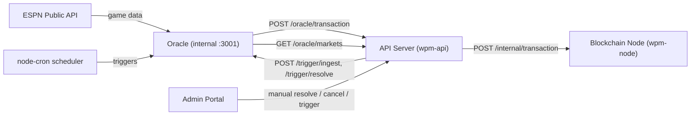
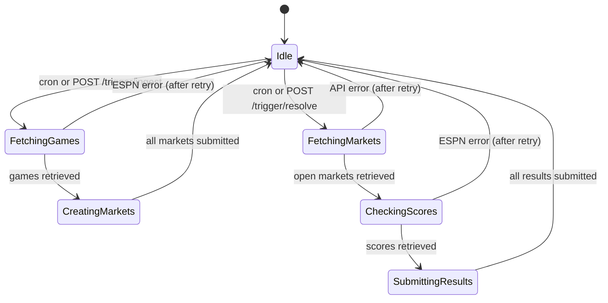

# Oracle Server Specification

> **System:** WPM (Wampum) Prediction Market Platform
> **Source:** [ARCHITECTURE.md](/Users/kevinpruett/code/wpm/ARCHITECTURE.md)
> **Status:** Draft
> **Last updated:** 2026-03-06

## 1. Overview

The oracle server bridges real-world sports data onto the WPM blockchain. It runs as a standalone Docker container (`wpm-oracle`) that communicates with the blockchain node through the API server's `/oracle/*` HTTP endpoints. It has two scheduled jobs: **ingest** (fetch upcoming games from ESPN, create on-chain markets) and **resolve** (fetch final scores from ESPN, settle or cancel on-chain markets). ESPN's public API is the sole data source. Per-sport adapter modules normalize ESPN responses into a common format, with NFL shipping at launch and the architecture supporting additional sports.

The oracle is the only entity authorized to submit `CreateMarket`, `ResolveMarket`, and `CancelMarket` transactions. Without it, no markets exist and no games are settled.

## 2. Context

### System Context Diagram



### Assumptions

- ESPN's public scoreboard and summary APIs remain available, unauthenticated, and free. If ESPN changes or removes these endpoints, the oracle is inoperable until adapters are updated.
- The API server is reachable at a stable internal Docker network hostname (`wpm-api`).
- The blockchain node accepts `CreateMarket` and `ResolveMarket` transactions only from the oracle's registered public key.
- Wall-clock time on the oracle container is accurate (NTP-synced) for correct cron scheduling and event time comparisons.
- One market per game (moneyline only). No spread, over/under, or prop markets.

### Constraints

- **Single data source.** ESPN only. No secondary or fallback data provider.
- **Binary outcomes only.** Every market is Team A wins vs. Team B wins. Ties, postponements, and cancellations result in market cancellation and refunds.
- **Docker deployment.** Runs as `wpm-oracle` container in the Docker Compose stack. Inter-service communication over the Docker internal network via HTTP.
- **No persistent local storage.** The oracle reconstructs all state from the blockchain node on startup. The only runtime state is an in-memory cache rebuilt each cycle.

## 3. Functional Requirements

### FR-1: Oracle Identity and Authorization

**Description:** The oracle authenticates to the blockchain using its own RSA key pair, distinct from the PoA signer key. The node recognizes this key as the sole authorized oracle.

**Key pair lifecycle:**

1. Generated once at system initialization (same key generation utility as the PoA signer).
2. Private key stored on disk at the path specified by `oracleKeyPath` config, mounted into the Docker container as a read-only volume.
3. Public key registered with the blockchain node at initialization.

**Transaction signing:** Every transaction the oracle submits (`CreateMarket`, `ResolveMarket`, `CancelMarket`) is signed with the oracle's RSA private key. The `sender` field contains the oracle's public key.

**Acceptance Criteria:**

- [ ] Given the oracle's public key is registered with the node, when the oracle submits a signed `CreateMarket` transaction, then the node accepts it.
- [ ] Given a non-oracle key, when a `CreateMarket` transaction is submitted signed by that key, then the node rejects it.
- [ ] Given the oracle's private key file is missing or unreadable, when the oracle process starts, then it exits immediately with a clear error log.

---

### FR-2: Ingest Job — Market Creation from Upcoming Games

**Description:** The ingest job fetches upcoming games from ESPN for all enabled sports and creates on-chain markets for each game not already represented.

**Trigger:** Cron schedule. Default: daily at 6:00 AM ET.

**Processing — step by step:**

1. For each enabled sport adapter:
   a. Call `adapter.fetchUpcomingGames(lookaheadDays)` to retrieve games within the lookahead window (default: 14 days).
   b. For each returned `RawGame`:
   - Query the API server (`GET http://wpm-api:3000/oracle/markets`) to check if a market with this `externalEventId` already exists (deduplication).
   - If a market already exists, skip.
   - If no market exists, construct a `CreateMarket` transaction:

```typescript
{
  id: uuid(),
  type: "CreateMarket",
  timestamp: Date.now(),
  sender: oraclePublicKey,
  signature: sign(payload, oraclePrivateKey),
  marketId: uuid(),
  sport: adapter.sport,               // e.g. "NFL"
  homeTeam: game.homeTeam,            // Full name from ESPN, e.g. "Kansas City Chiefs"
  awayTeam: game.awayTeam,            // Full name from ESPN, e.g. "Philadelphia Eagles"
  outcomeA: `${game.homeTeam} win`,   // Home team = outcome A (always)
  outcomeB: `${game.awayTeam} win`,   // Away team = outcome B (always)
  eventStartTime: game.startTime,     // Unix ms timestamp from ESPN
  seedAmount: config.defaultSeedAmount, // Default 1000, admin-overridable
  externalEventId: game.externalEventId // ESPN event ID, e.g. "401547417"
}
```

2. Submit each transaction to the API server via `POST http://wpm-api:3000/oracle/transaction`.
3. Log each market created (sport, teams, event start time, market ID).

**Outcome mapping convention:** Home team is always outcome A. Away team is always outcome B. This convention is critical for correct resolution.

**Acceptance Criteria:**

- [ ] Given 5 upcoming NFL games from ESPN and 0 existing markets, when ingest runs, then 5 `CreateMarket` transactions are submitted.
- [ ] Given 5 upcoming NFL games and 3 already have markets, when ingest runs, then only 2 new `CreateMarket` transactions are submitted.
- [ ] Given a game with `eventStartTime` within the 14-day window, when ingest runs, then a market is created for it.
- [ ] Given a game with `eventStartTime` more than 14 days out, when ingest runs, then no market is created for it.
- [ ] Given a game's `homeTeam` is "Kansas City Chiefs", when the market is created, then `outcomeA` is "Kansas City Chiefs win".

---

### FR-3: Resolve Job — Market Settlement from Final Scores

**Description:** The resolve job checks all open markets whose `eventStartTime` has passed, queries ESPN for game status, and submits resolution or cancellation transactions.

**Trigger:** Cron schedule. Default: every 30 minutes from 12:00 PM to 1:00 AM ET.

**Processing — step by step:**

1. Query the API server (`GET http://wpm-api:3000/oracle/markets`) for all markets where `status === "open"` and `eventStartTime < Date.now()`.
2. For each market:
   a. Determine which sport adapter to use from `market.sport`.
   b. Call `adapter.fetchGameResult(market.externalEventId)`.
   c. Branch on `result.status`:

| ESPN Status                           | Oracle Action      | Transaction                                        |
| ------------------------------------- | ------------------ | -------------------------------------------------- |
| `final` and `homeScore > awayScore`   | Resolve: home wins | `ResolveMarket` with `winningOutcome: "A"`         |
| `final` and `awayScore > homeScore`   | Resolve: away wins | `ResolveMarket` with `winningOutcome: "B"`         |
| `final` and `homeScore === awayScore` | Cancel: tie        | `CancelMarket` with reason `"Game ended in a tie"` |
| `postponed`                           | Cancel: postponed  | `CancelMarket` with reason `"Game postponed"`      |
| `cancelled`                           | Cancel: cancelled  | `CancelMarket` with reason `"Game cancelled"`      |
| `in_progress`                         | Skip               | None — game still playing                          |
| `scheduled`                           | Skip               | None — game hasn't started yet                     |

3. For `ResolveMarket`, include a human-readable `finalScore` field, e.g. `"Chiefs 27, Eagles 24"`.
4. Log each resolution or cancellation with market ID, teams, score, and outcome.

**ResolveMarket transaction structure:**

```typescript
{
  id: uuid(),
  type: "ResolveMarket",
  timestamp: Date.now(),
  sender: oraclePublicKey,
  signature: sign(payload, oraclePrivateKey),
  marketId: market.marketId,
  winningOutcome: "A" | "B",
  finalScore: "Chiefs 27, Eagles 24"
}
```

**CancelMarket transaction structure:**

```typescript
{
  id: uuid(),
  type: "CancelMarket",
  timestamp: Date.now(),
  sender: oraclePublicKey,
  signature: sign(payload, oraclePrivateKey),
  marketId: market.marketId,
  reason: "Game ended in a tie" | "Game postponed" | "Game cancelled"
}
```

**Acceptance Criteria:**

- [ ] Given a market for a game that ESPN reports as `final` with home 27, away 24, when resolve runs, then a `ResolveMarket` transaction is submitted with `winningOutcome: "A"`.
- [ ] Given a market for a game that ESPN reports as `final` with home 24, away 27, when resolve runs, then a `ResolveMarket` transaction is submitted with `winningOutcome: "B"`.
- [ ] Given a market for a game that ESPN reports as `final` with a tied score, when resolve runs, then a `CancelMarket` transaction is submitted with reason `"Game ended in a tie"`.
- [ ] Given a market for a game that ESPN reports as `postponed`, when resolve runs, then a `CancelMarket` transaction is submitted with reason `"Game postponed"`.
- [ ] Given a market for a game still `in_progress`, when resolve runs, then no transaction is submitted for that market.
- [ ] Given a market whose `eventStartTime` has not yet passed, when resolve runs, then that market is not queried against ESPN.

---

### FR-4: Deduplication

**Description:** The oracle must never create two markets for the same ESPN event.

**Mechanism:**

1. On startup, query the API server for all existing markets and build an in-memory map of `externalEventId -> marketId`.
2. Before each `CreateMarket` submission, check this map.
3. After successful submission, add the new entry to the map.
4. The map is also refreshed at the start of each ingest cycle by re-querying the API server.

**Why node-authoritative:** The blockchain node (accessed via the API server) is the source of truth. If the oracle restarts or the map is lost, it is rebuilt from on-chain state. There is no local database.

**Acceptance Criteria:**

- [ ] Given the oracle creates a market for ESPN event "401547417", when the next ingest cycle runs and ESPN still returns that event, then no duplicate market is created.
- [ ] Given the oracle is restarted, when it starts up, then it rebuilds the deduplication map from the node and does not create duplicates.
- [ ] Given two ingest cycles run in rapid succession (e.g., manual trigger), then no duplicates are created.

---

### FR-5: Sport Adapter System

**Description:** Each sport has an adapter module that encapsulates ESPN API querying and response normalization. Adapters implement a common interface.

**Adapter interface:**

```typescript
interface SportAdapter {
  /** Sport identifier, e.g. "NFL", "NBA" */
  readonly sport: string;

  /** ESPN API category path segment, e.g. "football" */
  readonly espnCategory: string;

  /** ESPN API league path segment, e.g. "nfl" */
  readonly espnLeague: string;

  /**
   * Fetch upcoming games within the given lookahead window.
   * Returns normalized game objects.
   */
  fetchUpcomingGames(days: number): Promise<RawGame[]>;

  /**
   * Fetch the current result of a specific game.
   * Used during the resolve job.
   */
  fetchGameResult(externalEventId: string): Promise<GameResult>;
}
```

**Normalized data types:**

```typescript
interface RawGame {
  externalEventId: string; // ESPN event ID
  homeTeam: string; // Full display name, e.g. "Kansas City Chiefs"
  awayTeam: string; // Full display name
  startTime: number; // Unix timestamp (ms)
  sport: string; // Adapter's sport identifier
}

interface GameResult {
  externalEventId: string;
  status: "final" | "in_progress" | "scheduled" | "postponed" | "cancelled";
  homeScore?: number; // Present when status is "final" or "in_progress"
  awayScore?: number; // Present when status is "final" or "in_progress"
}
```

**Adapter registry:** A map of `sport -> SportAdapter` instances. At startup, the oracle instantiates adapters for each sport listed in `config.enabledSports`.

**Acceptance Criteria:**

- [ ] Given the NFL adapter, when `fetchUpcomingGames(14)` is called, then it returns an array of `RawGame` objects with all fields populated.
- [ ] Given the NFL adapter, when `fetchGameResult("401547417")` is called for a completed game, then it returns a `GameResult` with status `"final"` and numeric scores.
- [ ] Given a new sport adapter is registered for "NBA", when ingest runs, then games from both NFL and NBA are fetched and markets created.

---

### FR-6: NFL Adapter (Launch)

**Description:** The NFL adapter is the only adapter at launch. It queries ESPN's public NFL endpoints.

**ESPN endpoints used:**

| Purpose        | URL                                                                     | Parameters                 |
| -------------- | ----------------------------------------------------------------------- | -------------------------- |
| Upcoming games | `https://site.api.espn.com/apis/site/v2/sports/football/nfl/scoreboard` | `?dates=YYYYMMDD-YYYYMMDD` |
| Game result    | `https://site.api.espn.com/apis/site/v2/sports/football/nfl/summary`    | `?event={eventId}`         |

These endpoints are public, unauthenticated, and require no API key.

**ESPN response parsing (scoreboard):**

```typescript
// ESPN scoreboard response shape (relevant fields):
{
  events: [
    {
      id: "401547417", // externalEventId
      date: "2024-02-11T23:30Z", // ISO 8601 → parse to Unix ms
      competitions: [
        {
          competitors: [
            {
              team: { displayName: "Kansas City Chiefs" },
              homeAway: "home",
              score: "27",
            },
            {
              team: { displayName: "Philadelphia Eagles" },
              homeAway: "away",
              score: "24",
            },
          ],
          status: {
            type: {
              name: "STATUS_FINAL", // or STATUS_SCHEDULED, STATUS_IN_PROGRESS
              completed: true,
            },
          },
        },
      ],
    },
  ];
}
```

**Mapping rules:**

- `homeTeam` = competitor where `homeAway === "home"`, using `team.displayName`.
- `awayTeam` = competitor where `homeAway === "away"`, using `team.displayName`.
- `startTime` = `Date.parse(event.date)`.
- `externalEventId` = `event.id`.
- Scores are parsed from string to number via `parseInt(competitor.score, 10)`.

**Status mapping:**

| ESPN `status.type.name` | Mapped `GameResult.status`          |
| ----------------------- | ----------------------------------- |
| `STATUS_FINAL`          | `"final"`                           |
| `STATUS_IN_PROGRESS`    | `"in_progress"`                     |
| `STATUS_SCHEDULED`      | `"scheduled"`                       |
| `STATUS_POSTPONED`      | `"postponed"`                       |
| `STATUS_CANCELED`       | `"cancelled"`                       |
| Any other value         | `"scheduled"` (safe default — skip) |

**Acceptance Criteria:**

- [ ] Given the ESPN scoreboard returns 3 events, when the NFL adapter parses the response, then 3 `RawGame` objects are returned with correct team names and start times.
- [ ] Given an ESPN summary for a completed game, when the NFL adapter parses it, then `status` is `"final"` and `homeScore`/`awayScore` are numeric.
- [ ] Given an ESPN response with an unrecognized status type, when the adapter parses it, then it defaults to `"scheduled"` and the game is skipped during resolution.

---

### FR-7: Future Sport Adapters

**Description:** Adding a new sport requires only creating a new adapter module and registering it.

**Steps to add a sport:**

1. Create a new class/module implementing `SportAdapter`.
2. Set `espnCategory` and `espnLeague` (ESPN URL pattern is consistent: `/sports/{category}/{league}/scoreboard`).
3. Register it in the adapter registry.
4. Add the sport string to `config.enabledSports`.

**Planned adapters (not at launch):**

| Sport  | `espnCategory` | `espnLeague` | Notes                                                                                            |
| ------ | -------------- | ------------ | ------------------------------------------------------------------------------------------------ |
| NBA    | `basketball`   | `nba`        | Ties impossible in NBA (OT until winner)                                                         |
| NHL    | `hockey`       | `nhl`        | Regular season ties impossible (shootout). Check playoff OT rules.                               |
| MLB    | `baseball`     | `mlb`        | No ties. Extra innings until winner.                                                             |
| Tennis | `tennis`       | (varies)     | Individual sport — needs different outcome label format                                          |
| Golf   | `golf`         | `pga`        | Tournament format — may need different market model; potentially out of scope for binary markets |

## 4. Non-Functional Requirements

### NFR-1: Performance

- **Ingest job duration:** Must complete within 60 seconds for up to 50 games across all sports.
- **Resolve job duration:** Must complete within 60 seconds for up to 100 open markets.
- **ESPN API call timeout:** 10 seconds per request. Abort and treat as failure if exceeded.
- **Memory:** The oracle should run within 128 MB of RAM. No persistent data beyond the in-memory deduplication map.

### NFR-2: Reliability

- **Best-effort semantics.** If a cycle fails, the next cycle catches up. No exactly-once guarantees required because deduplication and on-chain idempotency prevent duplicates.
- **Availability:** The oracle can be down for hours without permanent damage. Markets are created ahead of time (14-day window), and resolution retries every 30 minutes. A missed cycle delays but does not break the system.
- **Recovery:** Restart the container. No data migration or manual recovery needed.

### NFR-3: Security

- **Oracle private key** is mounted read-only into the container. Never logged, never transmitted. Never included in Docker images.
- **No public inbound network access.** The oracle makes outbound calls to ESPN and to the API server. It exposes a minimal internal HTTP API on port 3001 for health checks and admin-triggered jobs, but this port is accessible only within the Docker network and is **not** exposed to the internet or mapped to the host.
- **Transaction integrity.** All submitted transactions are RSA-signed. The node validates signatures before acceptance.

## 5. Interface Definitions

### Outbound Interfaces

#### Submit Transaction — HTTP POST

- **Destination:** API Server (`POST http://wpm-api:3000/oracle/transaction`)
- **Format:** JSON body matching the transaction type schema (see FR-2, FR-3)
- **Authentication:** Transaction is self-authenticating via RSA signature in the payload. No additional HTTP auth.
- **Delivery guarantee:** At-most-once per cycle. Failed submissions are retried on the next scheduled cycle, not immediately (except ESPN retries per FR error handling).
- **Expected responses:**

| Status                  | Meaning                                                            | Oracle Action                              |
| ----------------------- | ------------------------------------------------------------------ | ------------------------------------------ |
| `200` / `201`           | Transaction accepted                                               | Log success, update dedup map              |
| `400`                   | Validation error (e.g., market already exists, event time in past) | Log warning, skip                          |
| `409`                   | Conflict (duplicate market)                                        | Log info, skip (dedup working as intended) |
| `500`                   | Node error                                                         | Log error, will retry next cycle           |
| Timeout / network error | API unreachable                                                    | Log error, will retry next cycle           |

#### Query Markets — HTTP GET

- **Destination:** API Server (`GET http://wpm-api:3000/oracle/markets`)
- **Purpose:** Fetch existing markets for deduplication (ingest) and pending resolution targets (resolve).
- **Query parameters:**
  - `?status=open` — for resolve job (only open markets need checking)
  - `?status=open,resolved,cancelled` — for ingest dedup (all markets, to avoid recreating resolved/cancelled ones)

#### Query ESPN — HTTP GET

- **Destination:** ESPN public API (see FR-6 for URLs)
- **Authentication:** None required.
- **Rate limiting:** ESPN does not publish rate limits for public endpoints. The oracle makes at most ~50 requests per cycle (one scoreboard call per sport + one summary call per pending market). This is well within reasonable usage.

### Inbound Interfaces — Internal HTTP API (port 3001)

The oracle exposes a minimal HTTP API on port 3001, accessible only within the Docker network. This port is **not** published to the host or the internet.

#### Health Check — `GET /health`

Used by Docker `healthcheck` to verify the oracle process is alive and running.

- **Response (200):**

```json
{
  "status": "ok",
  "lastIngest": 1709712000000,
  "lastResolve": 1709713800000
}
```

- `lastIngest` and `lastResolve` are Unix ms timestamps of the last completed job, or `null` if no job has run yet.

#### Trigger Ingest — `POST /trigger/ingest`

Triggers an immediate ingest job. This is how the API server forwards admin manual-trigger requests.

- **Response (200):** Job summary on completion.

```json
{
  "job": "ingest",
  "gamesFetched": 12,
  "marketsCreated": 3,
  "marketsSkipped": 9,
  "errors": 0,
  "durationMs": 4200
}
```

- **Response (409):** A job is already running. The request is rejected.

```json
{ "error": "Ingest job already in progress" }
```

#### Trigger Resolve — `POST /trigger/resolve`

Triggers an immediate resolve job. Same semantics as trigger ingest.

- **Response (200):** Job summary on completion.

```json
{
  "job": "resolve",
  "marketsChecked": 8,
  "marketsResolved": 2,
  "marketsCancelled": 1,
  "marketsPending": 5,
  "errors": 0,
  "durationMs": 3100
}
```

- **Response (409):** A job is already running.

```json
{ "error": "Resolve job already in progress" }
```

## 6. Data Model

### Owned State (In-Memory Only)

#### Deduplication Map

| Field                  | Type     | Description                      |
| ---------------------- | -------- | -------------------------------- |
| key: `externalEventId` | `string` | ESPN event ID                    |
| value: `marketId`      | `string` | Corresponding on-chain market ID |

Rebuilt from the API server on startup. Refreshed at the start of each ingest cycle.

#### Adapter Registry

| Field          | Type           | Description                     |
| -------------- | -------------- | ------------------------------- |
| key: `sport`   | `string`       | Sport identifier, e.g. `"NFL"`  |
| value: adapter | `SportAdapter` | Adapter instance for that sport |

Built once at startup from `config.enabledSports`.

### Referenced State (Owned by Blockchain Node)

The oracle reads but does not own:

- **Markets** — status, externalEventId, eventStartTime, sport
- **Oracle public key registration** — the node knows which key is authorized

### Oracle Job State Machine



## 7. Error Handling

| #    | Error Scenario                               | Detection                                       | Response                                                                     | Recovery                                                                      |
| ---- | -------------------------------------------- | ----------------------------------------------- | ---------------------------------------------------------------------------- | ----------------------------------------------------------------------------- |
| E-1  | ESPN API returns HTTP error (4xx/5xx)        | HTTP status code                                | Log error. Retry once after 5 seconds.                                       | If retry fails, skip this cycle. Next scheduled run retries.                  |
| E-2  | ESPN API times out (>10s)                    | Request timeout                                 | Treat as E-1 (log, retry once, then skip).                                   | Next cycle retries.                                                           |
| E-3  | ESPN API returns malformed JSON              | JSON parse error                                | Log error with raw response body (truncated to 1KB). Skip this adapter/game. | Next cycle retries. Admin notified via logs.                                  |
| E-4  | ESPN returns unexpected status type          | Status not in known mapping                     | Map to `"scheduled"` (safe default). Log warning.                            | Game is skipped. Admin can manually resolve.                                  |
| E-5  | `CreateMarket` transaction rejected by node  | Non-200 HTTP response from API                  | Log error with response body and game details.                               | Next ingest cycle retries (dedup check will see the market is still missing). |
| E-6  | `ResolveMarket` transaction rejected by node | Non-200 HTTP response from API                  | Log error with response body, market ID, and score.                          | Next resolve cycle retries. Admin can manually resolve.                       |
| E-7  | API server unreachable                       | Connection refused / timeout                    | Log error. Skip entire cycle.                                                | Next cycle retries. Operator should check API server health.                  |
| E-8  | Oracle private key file missing or corrupt   | Startup key loading fails                       | Log fatal error. Exit process with code 1.                                   | Operator must fix key file and restart container.                             |
| E-9  | Score data missing for a "final" game        | `homeScore` or `awayScore` is `undefined`/`NaN` | Log warning. Skip this game.                                                 | Next cycle retries. If persistent, admin resolves manually.                   |
| E-10 | ESPN event ID not found in summary response  | Event missing from response                     | Log warning. Skip this game.                                                 | May indicate ESPN removed the event. Admin should review.                     |

### Idempotency

- **Ingest:** Idempotent by design. The deduplication map (backed by on-chain state) prevents duplicate market creation. If the same ingest job runs twice, the second run creates zero new markets.
- **Resolve:** Idempotent by design. The node rejects `ResolveMarket` for a market that is already resolved. If the oracle submits a resolution for an already-resolved market, the node returns a 400, and the oracle logs and skips.
- **Cancel:** Same as resolve — the node rejects `CancelMarket` for markets already resolved or cancelled.

### Retry Policy

| Scope                       | Strategy           | Max Retries | Backoff                                      |
| --------------------------- | ------------------ | ----------- | -------------------------------------------- |
| ESPN API call               | Retry once         | 1           | Fixed 5 seconds                              |
| Node transaction submission | No immediate retry | 0           | Deferred to next scheduled cycle             |
| Adapter-level (per game)    | Skip and continue  | 0           | Other games in the batch are still processed |

Partial failures are isolated: if one game fails to ingest or resolve, the remaining games in the batch are still processed.

## 8. Observability

### Logging

Structured JSON logging to stdout (captured by Docker). Key fields on every log entry:

| Field             | Type                                   | Description                             |
| ----------------- | -------------------------------------- | --------------------------------------- |
| `timestamp`       | ISO 8601                               | When the log was emitted                |
| `level`           | `info` / `warn` / `error` / `fatal`    | Severity                                |
| `job`             | `"ingest"` / `"resolve"` / `"startup"` | Which job produced the log              |
| `sport`           | `string`                               | Sport being processed (when applicable) |
| `externalEventId` | `string`                               | ESPN event ID (when applicable)         |
| `marketId`        | `string`                               | On-chain market ID (when applicable)    |
| `message`         | `string`                               | Human-readable description              |

**Log level usage:**

| Level   | When                                                                                                   |
| ------- | ------------------------------------------------------------------------------------------------------ |
| `info`  | Job started, job completed, market created, market resolved, market cancelled                          |
| `warn`  | ESPN returned unexpected data, game skipped due to ambiguity, transaction rejected by node (non-fatal) |
| `error` | ESPN API failure (after retry), API server unreachable, score parsing failure                          |
| `fatal` | Oracle key missing/corrupt, startup failure — process will exit                                        |

### Metrics (logged per cycle)

| Metric                      | Type    | Description                                |
| --------------------------- | ------- | ------------------------------------------ |
| `ingest.games_fetched`      | gauge   | Number of games returned by ESPN           |
| `ingest.markets_created`    | gauge   | Number of new markets submitted this cycle |
| `ingest.markets_skipped`    | gauge   | Number of games skipped (already exist)    |
| `ingest.errors`             | counter | Number of errors during this ingest cycle  |
| `ingest.duration_ms`        | gauge   | Total ingest cycle duration                |
| `resolve.markets_checked`   | gauge   | Number of open markets checked             |
| `resolve.markets_resolved`  | gauge   | Number of markets resolved this cycle      |
| `resolve.markets_cancelled` | gauge   | Number of markets cancelled this cycle     |
| `resolve.markets_pending`   | gauge   | Number of markets still in progress        |
| `resolve.errors`            | counter | Number of errors during this resolve cycle |
| `resolve.duration_ms`       | gauge   | Total resolve cycle duration               |
| `espn.requests`             | counter | Total ESPN API requests this cycle         |
| `espn.failures`             | counter | ESPN API failures this cycle               |

These metrics are emitted as structured log entries at the end of each job cycle.

### Health Monitoring

The oracle exposes a `GET /health` endpoint on internal port 3001 (see Inbound Interfaces). Docker uses this for container health checks. The admin portal can also check:

- **`GET /health` response** — returns `lastIngest` and `lastResolve` timestamps directly from the oracle process.
- **On-chain inference** — last ingest/resolve time can also be derived from the most recent `CreateMarket`, `ResolveMarket`, or `CancelMarket` transaction timestamps on-chain.
- **Stale market detection** — if open markets with `eventStartTime` more than 6 hours in the past have not been resolved, the oracle may be unhealthy.

## 9. Configuration

```typescript
interface OracleConfig {
  /** Internal API URL for the wpm-api container. */
  nodeApiUrl: string; // e.g. "http://wpm-api:3000"

  /** Filesystem path to the oracle's RSA private key (PEM format). */
  oracleKeyPath: string; // e.g. "/secrets/oracle-key.pem"

  /** List of sport identifiers to activate adapters for. */
  enabledSports: string[]; // ["NFL"] at launch

  /** Cron expression for the ingest job (evaluated in ET timezone). */
  ingestCron: string; // "0 6 * * *" — 6:00 AM ET daily

  /** Cron expression for the resolve job (evaluated in ET timezone). */
  resolveCron: string; // "*/30 12-24 * * *" — every 30min, 12PM-1AM ET

  /** How many days ahead to fetch games. */
  lookaheadDays: number; // 14

  /** Default WPM seed amount for new markets. Admin can override per-market. */
  defaultSeedAmount: number; // 1000

  /** HTTP request timeout for ESPN API calls, in milliseconds. */
  espnTimeoutMs: number; // 10000

  /** HTTP request timeout for node API calls, in milliseconds. */
  nodeTimeoutMs: number; // 5000

  /** Port for the oracle's internal HTTP API (health check, admin triggers). */
  internalPort: number; // 3001
}
```

**Environment variable mapping (Docker):**

| Env Var                  | Config Field        | Default                   |
| ------------------------ | ------------------- | ------------------------- |
| `ORACLE_NODE_API_URL`    | `nodeApiUrl`        | `http://wpm-api:3000`     |
| `ORACLE_KEY_PATH`        | `oracleKeyPath`     | `/secrets/oracle-key.pem` |
| `ORACLE_ENABLED_SPORTS`  | `enabledSports`     | `NFL` (comma-separated)   |
| `ORACLE_INGEST_CRON`     | `ingestCron`        | `0 6 * * *`               |
| `ORACLE_RESOLVE_CRON`    | `resolveCron`       | `*/30 12-24 * * *`        |
| `ORACLE_LOOKAHEAD_DAYS`  | `lookaheadDays`     | `14`                      |
| `ORACLE_DEFAULT_SEED`    | `defaultSeedAmount` | `1000`                    |
| `ORACLE_ESPN_TIMEOUT_MS` | `espnTimeoutMs`     | `10000`                   |
| `ORACLE_NODE_TIMEOUT_MS` | `nodeTimeoutMs`     | `5000`                    |
| `ORACLE_INTERNAL_PORT`   | `internalPort`      | `3001`                    |
| `TZ`                     | (system timezone)   | `America/New_York`        |

## 10. Startup Sequence

1. Load configuration from environment variables. Validate all required fields are present.
2. Load the oracle RSA private key from `oracleKeyPath`. If missing or unreadable, log fatal and exit.
3. Derive the public key from the private key (for use as `sender` in transactions).
4. Instantiate sport adapters for each sport in `enabledSports`. If an unknown sport is listed, log warning and skip it.
5. Query the API server for all existing markets. Build the deduplication map (`externalEventId -> marketId`).
6. Start the internal HTTP server on `internalPort` (default 3001) with `/health`, `/trigger/ingest`, and `/trigger/resolve` endpoints.
7. Register cron jobs for ingest and resolve using `node-cron`.
8. Log startup complete with: enabled sports, ingest schedule, resolve schedule, number of existing markets loaded, internal port.
9. Cron scheduler and internal HTTP server run until process termination.

## 11. Validation and Acceptance Criteria

### Critical Path Tests

| #    | Scenario                                            | Expected Outcome                                                     |
| ---- | --------------------------------------------------- | -------------------------------------------------------------------- |
| T-1  | Ingest with 0 existing markets and 5 upcoming games | 5 `CreateMarket` transactions submitted; all accepted by node        |
| T-2  | Ingest with all games already having markets        | 0 transactions submitted; no errors                                  |
| T-3  | Resolve with 3 completed games (2 decisive, 1 tie)  | 2 `ResolveMarket` + 1 `CancelMarket` transactions                    |
| T-4  | Resolve with games still in progress                | 0 transactions submitted for in-progress games                       |
| T-5  | Resolve with a postponed game                       | 1 `CancelMarket` transaction with reason "Game postponed"            |
| T-6  | ESPN API returns 500 on first call                  | Retry after 5s; if still failing, cycle skipped, no bad data         |
| T-7  | ESPN returns malformed JSON                         | Error logged, game skipped, other games still processed              |
| T-8  | Oracle restarted mid-cycle                          | On restart, dedup map rebuilt from node; no duplicates on next cycle |
| T-9  | Node rejects a transaction (400)                    | Error logged, other transactions in batch still submitted            |
| T-10 | Oracle key file missing at startup                  | Process exits with fatal log; does not run jobs                      |

### Integration Checkpoints

- [ ] Oracle can reach the API server at `nodeApiUrl` and successfully query markets.
- [ ] Oracle can reach ESPN's public scoreboard endpoint and parse the response.
- [ ] `CreateMarket` transactions submitted by the oracle are accepted by the node and appear on-chain.
- [ ] `ResolveMarket` transactions trigger the settlement engine and distribute payouts.
- [ ] `CancelMarket` transactions trigger refunds via the settlement engine.
- [ ] Admin portal displays oracle health indicators (last ingest/resolve timestamps).
- [ ] After a full container restart, the oracle resumes correct operation with no manual intervention.

### Rollout Strategy

1. Deploy `wpm-oracle` container as part of the Docker Compose stack.
2. Verify startup logs show successful key loading, adapter initialization, and dedup map build.
3. Manually trigger an ingest cycle via the API server's admin endpoint (which forwards to `POST http://wpm-oracle:3001/trigger/ingest`), or wait for the scheduled one, and confirm markets appear on-chain.
4. Confirm resolve cycle correctly settles a completed game in a test/staging environment.
5. Monitor structured logs for the first 24 hours for any `error` or `warn` entries.

## 12. Open Questions

| #   | Question                                                                                                                                                                                         | Status       | Resolution                                                                                                                                                                                |
| --- | ------------------------------------------------------------------------------------------------------------------------------------------------------------------------------------------------ | ------------ | ----------------------------------------------------------------------------------------------------------------------------------------------------------------------------------------- |
| 1   | Should the oracle expose a simple health endpoint (e.g., HTTP on an internal-only port) for Docker health checks, or is log-based monitoring sufficient?                                         | **Resolved** | Yes. The oracle exposes `GET /health` on internal port 3001. See Inbound Interfaces (Section 5) and Health Monitoring (Section 8).                                                        |
| 2   | Should the admin portal be able to trigger an ad-hoc ingest or resolve cycle (e.g., via an API call to the oracle), or should manual operations always go through direct transaction submission? | **Resolved** | Yes. The API server forwards admin trigger requests to `POST /trigger/ingest` and `POST /trigger/resolve` on the oracle's internal port 3001. See Inbound Interfaces (Section 5).         |
| 3   | For golf and tennis (non-head-to-head formats), should we define a different market model, or are those sports deferred until the market model is extended beyond binary?                        | Open         | Determines whether golf/tennis adapters are feasible under the current architecture. Owner: Product.                                                                                      |
| 4   | What is the expected behavior during the NFL offseason when there are no games? Should the oracle skip ingest silently, or log an explicit "no games found" message?                             | **Resolved** | Log silently at `info` level, no special handling. The ingest job runs, finds zero games, and logs the summary with `gamesFetched: 0, marketsCreated: 0`. No alerts or errors are raised. |
| 5   | Should the `defaultSeedAmount` be configurable per-sport (e.g., more liquidity for NFL playoff games), or is a single global default sufficient?                                                 | **Resolved** | A single global default is sufficient for now. Per-sport or per-event overrides can be added later if needed.                                                                             |

## Appendix

### Glossary

| Term                      | Definition                                                                                                     |
| ------------------------- | -------------------------------------------------------------------------------------------------------------- |
| **Adapter**               | A per-sport module that knows how to query ESPN and normalize responses into `RawGame` and `GameResult` types. |
| **Deduplication map**     | In-memory mapping of ESPN event IDs to on-chain market IDs, used to prevent creating duplicate markets.        |
| **ESPN event ID**         | A numeric string assigned by ESPN to uniquely identify a sporting event (stored as `externalEventId`).         |
| **Ingest**                | The oracle job that fetches upcoming games and creates on-chain markets.                                       |
| **Lookahead window**      | The number of days into the future the ingest job searches for games (default: 14).                            |
| **Outcome A / Outcome B** | Binary market outcomes. By convention, A = home team wins, B = away team wins.                                 |
| **Resolve**               | The oracle job that fetches final scores and submits resolution or cancellation transactions.                  |

### References

- [ARCHITECTURE.md](/Users/kevinpruett/code/wpm/ARCHITECTURE.md) — System architecture
- [Blockchain Node Spec](/Users/kevinpruett/code/wpm/specs/blockchain-node.md) — Transaction types, validation rules, AMM pool
- [Settlement Engine Spec](/Users/kevinpruett/code/wpm/specs/settlement-engine.md) — Payout and refund logic triggered by resolution/cancellation
