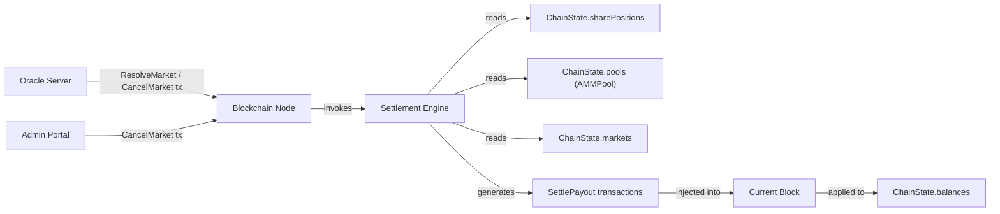
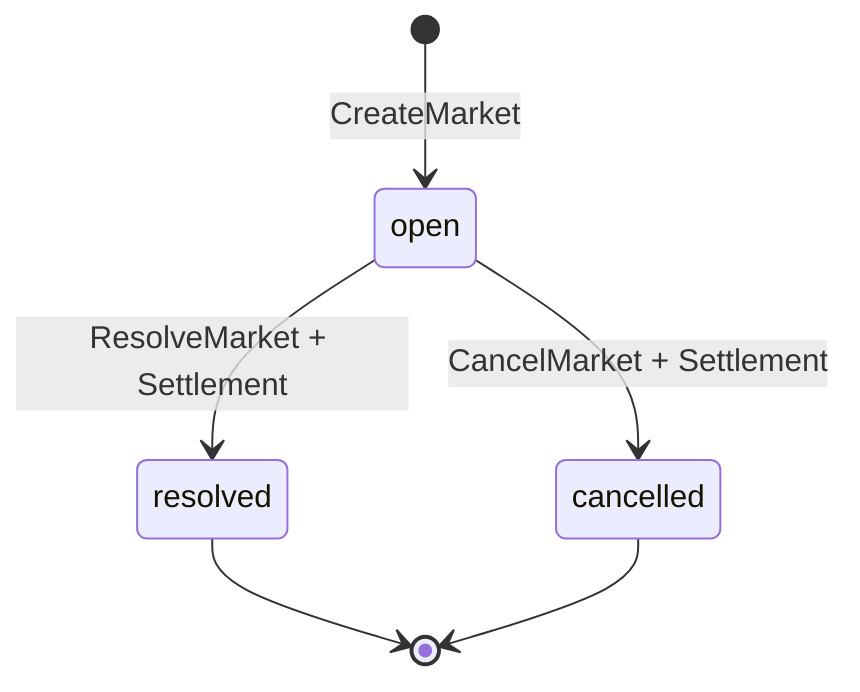

# Settlement Engine — Component Specification

> **System:** WPM (Wampum) Prediction Market Platform
> **Status:** Draft
> **Last updated:** 2026-03-06
> **Architecture doc:** [ARCHITECTURE.md](/ARCHITECTURE.md)
> **Related specs:** [blockchain-node.md](./blockchain-node.md)

## 1. Overview

The settlement engine is a module built into the blockchain node — not a standalone service. It is invoked synchronously during block production when the node processes a `ResolveMarket` or `CancelMarket` transaction. Its responsibilities are:

1. Read all share positions for the target market across all users and the AMM pool.
2. Compute payouts (resolution) or refunds (cancellation) for every position holder.
3. Compute the treasury liquidity return.
4. Generate `SettlePayout` transactions and inject them into the same block as the triggering transaction.
5. Clear the market's AMM pool and share position state.

The settlement engine owns no persistent state of its own. It reads from and writes to the blockchain node's in-memory `ChainState`.

## 2. Context

### System Context Diagram



### Assumptions

- The blockchain node is single-threaded; only one block is produced at a time. No concurrency control is needed within settlement.
- The AMM constant-product formula guarantees solvency — total WPM in the pool is always sufficient to cover all winning-share payouts.
- Share positions in `ChainState.sharePositions` are accurate and up-to-date at the time the settlement engine runs (all prior transactions in the block have already been applied).
- The treasury wallet address is the PoA signer's address and is always known to the node.
- All monetary values use 2-decimal precision (smallest unit: 0.01 WPM). Rounding uses banker's rounding (round half to even).

### Constraints

- Settlement must be **synchronous and atomic** — all `SettlePayout` transactions appear in the same block as the triggering `ResolveMarket` or `CancelMarket` transaction.
- Settlement logic must be **deterministic** — replaying the chain from JSONL must produce identical `SettlePayout` transactions. No randomness, no external I/O, no wall-clock reads.
- The settlement engine must **never** be invoked directly by an external caller. It is triggered only by the node's transaction-processing pipeline.
- `SettlePayout` transactions are **not user-submittable** — the node must reject any `SettlePayout` arriving via the mempool or API.

## 3. Functional Requirements

### FR-1: Resolution Settlement

**Description:** When a market is resolved, pay each holder of winning-outcome shares exactly 1.00 WPM per share and return remaining pool value to treasury.

**Trigger:** The node processes a valid `ResolveMarket` transaction (market status transitions from `open` to `resolved`).

**Input:**
- `marketId` — the market being resolved
- `winningOutcome` — `"A"` or `"B"`
- `ChainState.sharePositions[*][marketId]` — every user's share balances for this market
- `ChainState.pools[marketId]` — the AMM pool's current share counts

**Processing:**

```
1. Let winningOutcome = resolveTransaction.winningOutcome
2. Let losingOutcome = (winningOutcome === "A") ? "B" : "A"

3. Collect all user positions:
   userPayouts = []
   For each (address, positions) in ChainState.sharePositions:
     shares = positions[marketId]
     if shares is undefined: skip
     winningShares = shares[winningOutcome]
     if winningShares > 0:
       payout = round2(winningShares * 1.00)
       userPayouts.push({ recipient: address, amount: payout, payoutType: "winnings" })

4. Compute treasury liquidity return:
   poolWinningShares = pool.shares[winningOutcome]
   treasuryReturn = round2(poolWinningShares * 1.00)
   if treasuryReturn > 0:
     userPayouts.push({ recipient: TREASURY_ADDRESS, amount: treasuryReturn, payoutType: "liquidity_return" })

5. Generate one SettlePayout transaction per entry in userPayouts.

6. Clear market state:
   - Delete pool entry from ChainState.pools[marketId]
   - Delete all share positions for this marketId from ChainState.sharePositions
```

**Output:** An ordered list of `SettlePayout` transactions injected into the current block immediately after the `ResolveMarket` transaction.

**Acceptance Criteria:**
- [ ] Given a market with users holding winning shares, when `ResolveMarket` is processed, then each winner receives exactly `winningShares * 1.00` WPM credited to their balance.
- [ ] Given a market with users holding only losing shares, when `ResolveMarket` is processed, then those users receive no `SettlePayout` transaction and their balance is unchanged.
- [ ] Given a market where the pool still holds winning-outcome shares, when `ResolveMarket` is processed, then treasury receives a `liquidity_return` payout equal to those shares * 1.00.
- [ ] Given a resolved market, when the block is finalized, then the market's pool and all associated share positions are deleted from state.

### FR-2: Cancellation Settlement

**Description:** When a market is cancelled, refund each user their net cost basis (total WPM spent minus WPM received from sells). Return all remaining pool value to treasury.

**Trigger:** The node processes a valid `CancelMarket` transaction (market status transitions from `open` to `cancelled`).

**Input:**
- `marketId` — the market being cancelled
- `ChainState.sharePositions[*][marketId]` — every user's share balances
- `ChainState.pools[marketId]` — the AMM pool state

**Processing:**

```
1. Collect all user positions and their cost bases:
   userRefunds = []
   totalUserRefunds = 0
   For each (address, positions) in ChainState.sharePositions:
     shares = positions[marketId]
     if shares is undefined: skip
     costBasis = shares.costBasis
     if costBasis > 0:
       refund = round2(costBasis)
       userRefunds.push({ recipient: address, amount: refund, payoutType: "refund" })
       totalUserRefunds += refund

2. Compute treasury reclamation:
   // Treasury gets back everything remaining in the pool system
   totalPoolWPM = market.seedAmount + totalFeesCollected
   // Where totalFeesCollected is tracked on the pool or derived from k growth
   // Simplified: treasury gets total pool value minus user refunds
   treasuryReturn = round2(totalPoolWPM - totalUserRefunds)
   if treasuryReturn > 0:
     userRefunds.push({ recipient: TREASURY_ADDRESS, amount: treasuryReturn, payoutType: "liquidity_return" })

3. Generate one SettlePayout transaction per entry in userRefunds.

4. Clear market state (same as resolution).
```

**Output:** An ordered list of `SettlePayout` transactions injected into the current block immediately after the `CancelMarket` transaction.

**Acceptance Criteria:**
- [ ] Given a market with users holding shares, when `CancelMarket` is processed, then each user receives a refund equal to their tracked `costBasis` (rounded to 2 decimals).
- [ ] Given a cancelled market, when all user refunds are computed, then treasury receives the remaining pool value (`totalPoolWPM - sum(userRefunds)`).
- [ ] Given a cancelled market, when the block is finalized, then the market's pool and all associated share positions are deleted from state.
- [ ] Given a user who bought 100 WPM of shares and later sold 30 WPM worth, when the market is cancelled, then their refund is 70.00 WPM (their net cost basis).

### FR-3: Zero-Bet Market Settlement

**Description:** When a market with no user-held positions is resolved or cancelled, treasury reclaims the full seed amount.

**Trigger:** `ResolveMarket` or `CancelMarket` is processed for a market where no user holds any shares.

**Processing:**

```
1. Verify no user holds shares for this marketId.
2. Generate a single SettlePayout:
   { recipient: TREASURY_ADDRESS, amount: market.seedAmount, payoutType: "liquidity_return" }
3. Clear market state.
```

**Acceptance Criteria:**
- [ ] Given a market with zero bets (no PlaceBet transactions ever processed), when resolved, then treasury receives exactly `seedAmount` WPM.
- [ ] Given a market with zero bets, when cancelled, then treasury receives exactly `seedAmount` WPM.
- [ ] Given a zero-bet market, when settled, then exactly one `SettlePayout` transaction is generated.

### FR-4: SettlePayout Transaction Generation

**Description:** Each payout or refund is represented as a `SettlePayout` transaction with a well-defined structure.

**Transaction Schema:**

```typescript
interface SettlePayoutTransaction extends BaseTransaction {
  type: "SettlePayout";
  marketId: string;                                    // Market being settled
  recipient: string;                                   // User or treasury address
  amount: number;                                      // WPM payout (2 decimal precision, > 0)
  payoutType: "winnings" | "refund" | "liquidity_return";
}
```

**Field rules:**

| Field | Constraints |
|-------|-------------|
| `id` | UUID v4, unique across all transactions |
| `type` | Always `"SettlePayout"` |
| `timestamp` | Same timestamp as the triggering `ResolveMarket` or `CancelMarket` transaction |
| `sender` | System address (e.g., `"SYSTEM"`) — not a user wallet |
| `signature` | Signed by the PoA signer key |
| `marketId` | Must reference an existing market in `resolved` or `cancelled` status |
| `recipient` | Must be a valid address (user public key or treasury address) |
| `amount` | `> 0`, 2-decimal precision. Zero-amount payouts are never generated. |
| `payoutType` | `"winnings"` for resolution winners, `"refund"` for cancellation refunds, `"liquidity_return"` for treasury reclamation |

**Ordering within the block:**
1. The triggering `ResolveMarket` or `CancelMarket` transaction comes first.
2. All `SettlePayout` transactions follow immediately, ordered by: user payouts (sorted by recipient address ascending), then treasury `liquidity_return` last.

**Acceptance Criteria:**
- [ ] Given a settlement, when `SettlePayout` transactions are generated, then each has a unique UUID, valid PoA signature, and correct `payoutType`.
- [ ] Given a settlement, when any computed payout rounds to 0.00 WPM, then no `SettlePayout` transaction is generated for that recipient.
- [ ] Given a settlement, when the block is serialized, then `SettlePayout` transactions appear after the trigger transaction and before any unrelated transactions.
- [ ] Given a `SettlePayout` transaction submitted via the API/mempool, when the node validates it, then it is rejected (only system-generated payouts are accepted).

### FR-5: Balance Application

**Description:** When `SettlePayout` transactions are applied to state, the recipient's WPM balance increases by the payout amount.

**Processing:**
```
For each SettlePayout transaction in the block:
  ChainState.balances[recipient] += amount
```

**Acceptance Criteria:**
- [ ] Given a user with balance 500.00 WPM who wins a 150.00 WPM payout, when the block is applied, then their balance is 650.00 WPM.
- [ ] Given treasury with balance 8,000,000.00 WPM receiving a 1,000.00 WPM liquidity return, when the block is applied, then treasury balance is 8,001,000.00 WPM.

## 4. Non-Functional Requirements

### Performance

- **Latency:** Settlement for a single market must complete in under 50ms, including transaction generation. This is part of block production, which targets under 100ms total.
- **Scale:** A market may have at most ~50 unique position holders (small friend group). Settlement is O(n) in the number of position holders.

### Reliability

- **Determinism:** Settlement is a pure function of chain state. Replaying the JSONL chain file must produce byte-identical `SettlePayout` transactions. This is the primary reliability requirement.
- **Atomicity:** If any step of settlement fails (e.g., a bug in payout calculation), the entire block must be rejected — no partial settlement is permitted.

### Security

- **Authorization:** `SettlePayout` transactions are only generated internally by the node. The mempool and API reject any externally submitted `SettlePayout`.
- **Signature:** Each `SettlePayout` is signed by the PoA signer key, making it verifiable during chain replay.
- **Audit trail:** Every payout is a first-class transaction on the chain, fully visible in the JSONL log and queryable via the API.

## 5. Data Model

### Data Ownership

- **Owns:** Nothing — the settlement engine is stateless. It reads from and writes to `ChainState` structures owned by the blockchain node.
- **Reads:** `ChainState.markets`, `ChainState.pools`, `ChainState.sharePositions`
- **Writes:** `ChainState.balances` (via generated `SettlePayout` transactions), deletes entries from `ChainState.pools` and `ChainState.sharePositions`

### State Accessed

| State | Type | Access | Purpose |
|-------|------|--------|---------|
| `markets[marketId]` | `Market` | Read | Get market status, seed amount, winning outcome |
| `pools[marketId]` | `AMMPool` | Read + Delete | Get pool share counts for treasury return / price calc |
| `sharePositions[address][marketId]` | `{ A: number, B: number, costBasis: number }` | Read + Delete | Get each user's share holdings and net WPM spent |
| `balances[address]` | `number` | Write (via tx) | Credit payout amounts |

### Market State Transitions



The settlement engine is responsible for the side effects that accompany the `open -> resolved` and `open -> cancelled` transitions. The market status field itself is set by the node's transaction processor before the settlement engine runs.

## 6. Interface Definition

### Inbound Interface — Internal Function Call

The settlement engine exposes a single function to the blockchain node's transaction processor:

```typescript
function settle(
  trigger: ResolveMarketTransaction | CancelMarketTransaction,
  state: ChainState
): SettlePayoutTransaction[]
```

- **Caller:** Blockchain node transaction processor, during block production.
- **When called:** Immediately after the `ResolveMarket` or `CancelMarket` transaction has been validated and the market status has been updated.
- **Returns:** An ordered array of `SettlePayout` transactions to be appended to the current block.
- **Side effects on state:** Deletes pool and share-position entries for the settled market from `state`. Balance updates happen when the returned transactions are applied by the node.

### Outbound Interface — Generated Transactions

The settlement engine produces `SettlePayout` transactions (schema defined in FR-4). These are returned to the caller and are not emitted to any external system directly.

## 7. Error Handling

| Error Scenario | Detection | Response | Recovery |
|---|---|---|---|
| Market not found in state | `markets[marketId]` is undefined | Reject the triggering transaction; do not produce a block | Transaction returns to mempool or is discarded (should never happen if validation is correct) |
| Pool not found for market | `pools[marketId]` is undefined | Reject the triggering transaction | Same as above |
| Negative payout computed | `amount < 0` after calculation | Abort settlement; reject the block | Indicates a bug — log error, halt block production for manual inspection |
| Rounding causes total payouts to exceed pool value | Sum of all `SettlePayout` amounts > pool WPM | Abort settlement; reject the block | Indicates a precision bug — requires code fix |
| Division by zero in price calc (cancellation) | `pool.sharesA + pool.sharesB === 0` | Treat as zero-bet market (FR-3) | Generate single treasury reclamation |
| Duplicate settlement attempt | Market status is already `resolved` or `cancelled` | Rejected at transaction validation (before settlement engine is invoked) | N/A — this is handled upstream |

### Idempotency

Settlement is **not** independently idempotent — it deletes state (pool, positions) after running. However, it does not need to be: the blockchain's JSONL replay mechanism ensures settlement runs exactly once per market. During replay, state is rebuilt transaction-by-transaction, and settlement transactions are simply re-applied from the stored block without re-invoking the settlement engine.

### Solvency Invariant

The following invariant must hold after every settlement:

```
totalPayouts = sum of all SettlePayout amounts for this market
totalPoolValue = (for resolution) total winning shares outstanding * 1.00
                 (for cancellation) sum(user costBases) + treasury reclamation

Assert: totalPayouts <= totalPoolValue + 0.01
// The 0.01 tolerance accounts for rounding across multiple 2-decimal payouts
```

If this invariant is violated, the settlement engine must abort and refuse to produce the block.

## 8. Observability

### Logging

All log entries are structured JSON with the following fields:

| Event | Level | Fields | Description |
|-------|-------|--------|-------------|
| `settlement.started` | INFO | `marketId`, `trigger` (`resolve` or `cancel`), `positionCount` | Settlement processing begins |
| `settlement.payout_computed` | DEBUG | `marketId`, `recipient`, `amount`, `payoutType` | Individual payout calculated |
| `settlement.treasury_return` | INFO | `marketId`, `amount` | Treasury liquidity return amount |
| `settlement.completed` | INFO | `marketId`, `trigger`, `totalPayouts`, `txCount`, `durationMs` | Settlement finished successfully |
| `settlement.aborted` | ERROR | `marketId`, `reason`, `state_snapshot` | Settlement failed — block rejected |
| `settlement.solvency_check` | DEBUG | `marketId`, `totalPayouts`, `poolValue`, `delta` | Solvency invariant check result |

### Metrics

| Metric | Type | Description |
|--------|------|-------------|
| `settlement_total` | Counter | Total settlements executed (labels: `trigger=resolve\|cancel`, `status=success\|error`) |
| `settlement_payouts_total` | Counter | Total `SettlePayout` transactions generated |
| `settlement_payout_wpm_total` | Counter | Total WPM distributed via settlement |
| `settlement_treasury_return_wpm_total` | Counter | Total WPM returned to treasury via settlement |
| `settlement_duration_ms` | Histogram | Time taken to execute settlement |

## 9. Validation & Acceptance Criteria

### Critical Path Tests

These scenarios must pass for the settlement engine to be considered correct:

1. **Basic resolution — single winner:** One user holds 100 A shares, outcome A wins. User receives 100.00 WPM. Treasury receives its remaining pool winning shares * 1.00.

2. **Basic resolution — multiple winners:** Three users hold A shares (50, 30, 20). Outcome A wins. Each receives their shares * 1.00 (50.00, 30.00, 20.00).

3. **Resolution — losers get nothing:** User holds 100 B shares, outcome A wins. User receives no payout. No `SettlePayout` transaction is generated for them.

4. **Resolution — user holds both sides:** User holds 60 A shares and 40 B shares. Outcome A wins. User receives 60.00 WPM (only winning side).

5. **Cancellation — full cost-basis refund:** User spent 100.00 WPM buying A shares (net of any sells). Market is cancelled. User receives 100.00 WPM refund.

6. **Cancellation — user holds both sides:** User spent 80.00 WPM buying A shares and 40.00 WPM buying B shares, sold 10.00 WPM of A shares. Net cost basis = 110.00 WPM. User receives 110.00 WPM refund.

7. **Zero-bet market — resolution:** No users hold shares. Treasury receives exactly `seedAmount`.

8. **Zero-bet market — cancellation:** No users hold shares. Treasury receives exactly `seedAmount`.

9. **All bets on one side — losing side wins:** All users bet A, outcome B wins. All users get 0. Treasury reclaims its pool B shares * 1.00 plus any remaining value.

10. **All bets on one side — winning side wins:** All users bet A, outcome A wins. All users receive their A shares * 1.00. Treasury's A shares in pool (if any) return as liquidity.

11. **Solvency check:** For every test case, assert `sum(all SettlePayout amounts) <= total WPM that entered the pool (seed + all buy amounts - all sell returns)`.

12. **Deterministic replay:** Run settlement, serialize the block to JSONL, replay from JSONL, verify identical state.

13. **External SettlePayout rejection:** Submit a `SettlePayout` transaction via the API. Verify it is rejected with an authorization error.

### Integration Checkpoints

- [ ] Node produces a block containing `ResolveMarket` + N `SettlePayout` transactions atomically.
- [ ] API server returns updated balances immediately after the settlement block is produced.
- [ ] SSE event stream emits the settlement block with all `SettlePayout` transactions.
- [ ] JSONL replay after restart reconstructs identical balances to pre-restart state.
- [ ] Admin portal shows the market as `resolved` or `cancelled` with payout details.

## 10. Edge Cases — Detailed

### Rounding

With 2-decimal precision, rounding errors can accumulate across many payouts. The settlement engine must:

1. Round each individual payout to 2 decimals using banker's rounding.
2. After computing all payouts, verify the solvency invariant (total payouts <= pool value + 0.01 tolerance).
3. If rounding causes the total to exceed pool value by more than 0.01, subtract the excess from the treasury `liquidity_return` payout (treasury absorbs rounding dust).
4. If there is no treasury return to absorb the excess (e.g., pool is fully depleted), the last user payout in sort order is reduced by the excess.

### Market Resolved During Active Trading Window

This cannot happen by design: `ResolveMarket` validation requires `eventStartTime` to have passed, and `PlaceBet`/`SellShares` validation requires `eventStartTime` to be in the future. There is a clean cutoff with no overlap.

### Multiple Resolutions for the Same Market

The node's transaction validation rejects `ResolveMarket` if the market status is not `open`. A market can only be settled once. If a duplicate `ResolveMarket` arrives in the mempool, it is rejected before the settlement engine is invoked.

### Very Small Share Positions

A user might hold 0.01 shares (the minimum). Their payout would be `0.01 * 1.00 = 0.01` WPM — this is valid and a `SettlePayout` transaction is generated. Positions smaller than 0.01 are impossible due to the 2-decimal precision constraint.

### Cancellation When Pool Is Heavily Skewed

If priceA = 0.99 and priceB = 0.01, the refund is still based on each user's net cost basis, not the current share prices. A user who bought B shares cheaply at 0.01 and spent 10 WPM total receives their full 10 WPM back. This is fair because cancellation means the market outcome is void — users should not be penalized for price movements on a voided event.

## Appendix

### Glossary

| Term | Definition |
|------|------------|
| **AMM** | Automated Market Maker — the constant-product pricing mechanism for outcome shares |
| **Winning shares** | Shares of the outcome that was declared the winner in a `ResolveMarket` transaction |
| **Losing shares** | Shares of the outcome that was not declared the winner |
| **Seed amount** | WPM initially deposited by treasury to create the AMM pool (default 1,000 WPM) |
| **Liquidity return** | WPM returned to treasury from the pool after settlement |
| **Position** | A user's share holdings for a specific market (`{ A: number, B: number, costBasis: number }`) |
| **Pool value** | Total WPM equivalent held by the AMM pool, computed from share counts and prices |
| **PoA signer** | The Proof of Authority key that signs all blocks and system transactions |

### References

- [ARCHITECTURE.md](/ARCHITECTURE.md) — system-wide architecture document
- [blockchain-node.md](./blockchain-node.md) — blockchain node spec (defines `ChainState`, transaction types, AMM math)
