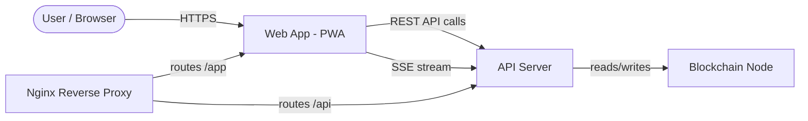
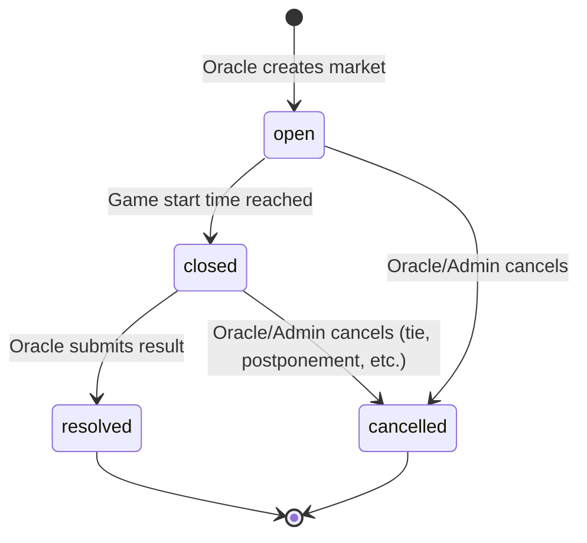

# Web App Specification

> **System:** WPM (Wampum) Prediction Market Platform
> **Status:** Draft
> **Last updated:** 2026-03-06
> **Architecture doc:** [ARCHITECTURE.md](/Users/kevinpruett/code/wpm/ARCHITECTURE.md)

## 1. Overview

The Web App is the user-facing Progressive Web App (PWA) for the WPM prediction market platform. It is the sole interface through which users browse sports betting markets, buy and sell outcome shares via the on-chain AMM, track their portfolio, compete on leaderboards, and manage their wallet. The app is mobile-first, authenticates via WebAuthn/passkeys, and receives real-time updates through Server-Sent Events (SSE). Wallet keys are custodial (server-side); the passkey proves identity, not key ownership.

## 2. Context

### System Context Diagram



### Assumptions

- The API Server is the only backend the Web App communicates with. The Web App never talks directly to the Blockchain Node or Oracle.
- The user base is a small friend group (tens of users, not thousands). Performance targets reflect this scale.
- WebAuthn/passkey support is available in all target browsers (iOS Safari 16+, Android Chrome 109+, desktop Chrome/Firefox/Safari).
- The API Server handles all WebAuthn ceremony server-side logic; the Web App only drives the browser-side credential API.
- JWT tokens are the sole authentication mechanism for API calls after initial passkey ceremony.
- All monetary values use 2-decimal WPM amounts. Share quantities also use 2-decimal precision.
- ESPN is the upstream data source for game metadata (team names, start times, scores), surfaced to the Web App through the API.

### Constraints

| Constraint       | Detail                                                                                       |
| ---------------- | -------------------------------------------------------------------------------------------- |
| Deployment       | Static assets served from `wpm-web` Docker container behind Nginx                            |
| Protocol         | HTTPS only (TLS terminated at Nginx)                                                         |
| Auth             | WebAuthn/passkeys only; no username/password fallback                                        |
| Real-time        | SSE only; no WebSocket                                                                       |
| Minimum viewport | 375px width (iPhone SE)                                                                      |
| PWA              | Must be installable to home screen on iOS and Android                                        |
| Token precision  | 2 decimal places (0.01 WPM smallest unit)                                                    |
| Framework        | React + Vite (SPA) with `vite-plugin-pwa` for service worker generation and web app manifest |
| Styling          | Tailwind CSS                                                                                 |

## 3. Functional Requirements

### FR-1: User Registration (Onboarding)

**Description:** New users join through an invite-only flow that creates their account, registers a passkey, provisions a custodial wallet, and airdrops 100,000 WPM.

**Trigger:** User navigates to `/join` (or taps "Join" from landing page).

**Route:** `/join`

**Flow:**

1. User enters invite code.
2. Web App sends `POST /api/auth/register/validate-code` with the code.
3. API validates the code and returns success or error.
4. On success, user enters display name and email address.
5. Web App initiates WebAuthn registration: calls `POST /api/auth/register/challenge` to get creation options, then invokes `navigator.credentials.create()`.
6. Web App sends the credential response to `POST /api/auth/register/complete` along with name and email.
7. API creates the user, wallet, processes airdrop (100,000 WPM) and referral reward (5,000 WPM to inviter), and returns a JWT.
8. Web App stores JWT in memory, displays success screen ("Welcome! You received 100,000 WPM"), then redirects to `/markets`.

**Input Validation:**
| Field | Rules |
|-------|-------|
| Invite code | Non-empty string; validated server-side |
| Display name | 1-50 characters; trimmed; no leading/trailing whitespace |
| Email | Valid email format (client-side regex + server-side validation) |

**Acceptance Criteria:**

- [ ] Given a valid invite code, when the user completes all steps, then their account exists with 100,000 WPM balance and they land on `/markets` authenticated.
- [ ] Given an invalid or already-used invite code, when submitted, then an inline error appears ("Invalid invite code") and the flow does not advance.
- [ ] Given the browser does not support WebAuthn, when the user reaches the passkey step, then a clear message is shown ("Your browser does not support passkeys. Please use a supported browser.") with no way to proceed.
- [ ] Given a duplicate email, when submitted, then the API returns an error and the Web App shows "An account with this email already exists."
- [ ] Given successful registration, when the inviter checks their wallet, then they have received a 5,000 WPM referral reward.

### FR-2: User Login (Returning User)

**Description:** Returning users authenticate with their registered passkey.

**Trigger:** User taps "Sign In" on the landing page (`/`).

**Flow:**

1. Web App calls `POST /api/auth/login/challenge` to get authentication options.
2. Browser invokes `navigator.credentials.get()` with the challenge.
3. Web App sends the signed assertion to `POST /api/auth/login/verify`.
4. API verifies the signature and returns a JWT.
5. Web App stores JWT in memory, redirects to `/markets`.

**Acceptance Criteria:**

- [ ] Given a registered user with a valid passkey, when they tap "Sign In" and complete the biometric/PIN prompt, then they are authenticated and redirected to `/markets` within 3 seconds (excluding biometric wait time).
- [ ] Given the passkey ceremony is cancelled by the user, when the prompt is dismissed, then the Web App remains on the landing page with no error (user can retry).
- [ ] Given the passkey verification fails server-side, when the API returns an error, then the Web App shows "Authentication failed. Please try again."

### FR-3: Session Management

**Description:** Authenticated sessions use a dual-token model: a short-lived access token (JWT) for API calls and a long-lived refresh token in an httpOnly cookie for silent session renewal.

**Rules:**

- Access token (JWT): 15-minute expiry, stored in a JavaScript variable (not localStorage, not sessionStorage, not cookies) to minimize XSS token theft surface.
- Refresh token: 7-day expiry, stored in an httpOnly cookie.
- On every API call, if the server returns 401, the Web App first attempts a silent refresh via `POST /api/auth/refresh`. If the refresh succeeds, the original request is retried with the new access token. If the refresh fails (cookie expired or missing), the Web App triggers a passkey re-authentication flow (modal overlay: "Session expired. Tap to sign in.").
- On page refresh, the Web App calls `POST /api/auth/refresh`. The server validates the httpOnly refresh cookie; if valid, a new access token is returned silently. If the cookie is expired or missing, the user is prompted for passkey re-authentication.
- Authenticated users who navigate to `/` are redirected to `/markets`.
- Unauthenticated users who navigate to any protected route are redirected to `/`.

**Acceptance Criteria:**

- [ ] Given a user with an expired JWT, when they perform any action requiring auth, then a modal passkey prompt appears and, upon successful re-auth, the original action completes without data loss.
- [ ] Given a user refreshes the page, when the httpOnly refresh cookie is valid, then `POST /api/auth/refresh` returns a new JWT and the session is restored without a passkey prompt.
- [ ] Given a user refreshes the page, when the httpOnly refresh cookie is expired or missing, then the passkey sign-in prompt appears.

### FR-4: Market Browsing

**Description:** The home screen displays all open markets with real-time odds, grouped by sport and sorted by game start time.

**Route:** `/markets`

**Data source:** `GET /api/markets?status=open`

**Display per market card:**
| Element | Source | Format |
|---------|--------|--------|
| Sport | `market.sport` | Badge (e.g., "NFL") |
| Teams | `market.homeTeam`, `market.awayTeam` | "Chiefs vs Eagles" |
| Game start time | `market.startsAt` | Localized time + "closes in Xh Ym" countdown |
| Outcome A probability | `market.probA` | Percentage, e.g., "62%" |
| Outcome B probability | `market.probB` | Percentage, e.g., "38%" |
| Outcome A payout | `1 / market.probA` | Multiplier, e.g., "1.61x" |
| Outcome B payout | `1 / market.probB` | Multiplier, e.g., "2.63x" |
| Volume | `market.volume` | Formatted WPM, e.g., "5,230 WPM" |
| User position | `market.userShares` | "50 shares (A)" or hidden if none |

**Market card wireframe:**

```
+------------------------------+
| NFL  *  Sun 4:25 PM ET       |
| Chiefs vs Eagles             |
|                              |
|  Chiefs 62%    Eagles 38%    |
|  1.61x         2.63x        |
|                              |
| Volume: 5,230 WPM           |
| Your position: 50 shares (A) |
+------------------------------+
```

**Filtering and sorting:**
| Filter/Sort | Behavior |
|-------------|----------|
| Sport tabs | Filter markets by sport (NFL, NBA, etc.). "All" tab is default. |
| Sort by time | Default: soonest game first |
| "My Bets" toggle | Show only markets where the user holds shares |

**Real-time behavior:** SSE `price:update` events update probability and payout multiplier on visible cards without full page refresh. New markets appear via `market:created` events. Resolved/cancelled markets update their status badge and move to a "Recently Resolved" section or disappear based on state.

**Empty states:**
| Condition | Display |
|-----------|---------|
| No open markets | "No markets available right now. Check back tomorrow after 6 AM ET when new games are posted." |
| No markets matching filter | "No [sport] markets open right now." |
| No positions for "My Bets" | "You haven't placed any bets yet. Browse the markets above to get started." |

**Acceptance Criteria:**

- [ ] Given 5 open markets across 2 sports, when the user loads `/markets`, then all 5 appear grouped by sport with correct odds and payout multipliers.
- [ ] Given a market's price changes via SSE, when the event arrives, then the card updates within 500ms without page refresh.
- [ ] Given the user selects the "NFL" filter, when applied, then only NFL markets are shown.
- [ ] Given the user holds shares in 2 of 5 markets, when "My Bets" is toggled on, then only those 2 markets appear.
- [ ] Given zero open markets, when the user loads `/markets`, then the empty state message is displayed.

### FR-5: Market Detail and Trading

**Description:** Detailed view of a single market with full odds display, trading panel, user position summary, and recent activity.

**Route:** `/markets/:marketId`

**Data source:** `GET /api/markets/:marketId`

**Sections:**

#### 5a. Market Header

- Teams, sport, game start time (localized).
- Status badge: `open` (green), `closed` (yellow), `resolved` (blue with winning team), `cancelled` (red).
- Countdown to betting close (game start time).

#### 5b. Odds Panel

- Large probability display for each outcome (e.g., "Chiefs 62% | Eagles 38%").
- Payout multiplier for each outcome.
- Prices update in real-time via SSE.

#### 5c. Trading Panel

**Buy mode (default):**
| Step | Detail |
|------|--------|
| 1. Select outcome | Toggle between Team A and Team B |
| 2. Enter amount | WPM amount to spend. Input field with increment buttons (+10, +100, +1000). "Max" button fills available balance. |
| 3. Preview | Computed client-side using constant product formula: shares received, effective price per share, price impact %, fee (1% of input amount) |
| 4. Submit | "Place Bet" button. Calls `POST /api/markets/:marketId/buy` |

**Sell mode:**
| Step | Detail |
|------|--------|
| 1. Select outcome | Toggle between Team A and Team B (only outcomes with held shares are selectable) |
| 2. Enter shares | Number of shares to sell. "Sell All" button fills total held shares. |
| 3. Preview | WPM received, effective price per share, fee (1%) |
| 4. Submit | "Sell Shares" button. Calls `POST /api/markets/:marketId/sell` |

**Trading panel wireframe:**

```
+------------------------------+
|  [Buy]  [Sell]               |
|                              |
|  o Chiefs win    * Eagles win|
|                              |
|  Amount: [____100____] WPM   |
|  [+10] [+100] [+1000] [Max] |
|                              |
|  You receive: 147.06 shares  |
|  Avg price:   0.68 WPM/share|
|  Price impact: +2.3%        |
|  Fee:         1.00 WPM      |
|                              |
|  [ Place Bet ]               |
+------------------------------+
```

**Preview computation (client-side):**
The client replicates the constant product AMM formula to show accurate previews:

```
Given pool state: reserveA, reserveB (where reserveA * reserveB = k)
User buys outcome A with inputAmount WPM:
  fee = inputAmount * 0.01
  netInput = inputAmount - fee
  sharesReceived = reserveA - (k / (reserveB + netInput))
  effectivePrice = inputAmount / sharesReceived
  priceImpact = (newProbA - oldProbA) / oldProbA * 100
```

**Trade submission response handling:**
| API Response | Web App Behavior |
|-------------|-----------------|
| 200 OK | Success toast ("Bought 147.06 Chiefs shares"), update position display, update odds |
| 400 Bad Request (insufficient balance) | Inline error "Insufficient balance. You have X WPM available." |
| 400 Bad Request (market closed) | Inline error "Betting is closed for this market." |
| 400 Bad Request (amount too small) | Inline error "Minimum bet is 1.00 WPM." |
| 409 Conflict (stale price) | Warning "Prices have changed. Review updated preview." with refreshed preview |
| 500 Server Error | Error toast "Something went wrong. Please try again." |

**Trading guards:**

- "Place Bet" / "Sell Shares" button is disabled when: amount is empty or zero, amount exceeds balance (buy) or held shares (sell), market status is not `open`, or a submission is in-flight.
- Debounce trade submissions: ignore duplicate clicks within 2 seconds.
- After successful trade, clear the amount input and refresh position data.

#### 5d. Position Summary (shown only if user holds shares)

| Field                   | Source                       |
| ----------------------- | ---------------------------- |
| Shares held (A)         | `position.sharesA`           |
| Shares held (B)         | `position.sharesB`           |
| Cost basis              | `position.costBasis`         |
| Current estimated value | Computed from current prices |
| Unrealized P&L          | Current value - cost basis   |

#### 5e. Market Activity

- Recent trades list (most recent first, capped at 20 visible).
- Each entry: user display name, action (bought/sold), shares, outcome, timestamp. Trades are not anonymous; user names are always visible.
- Total volume display.

**Market status-dependent behavior:**
| Status | Trading Panel | Position Summary | Activity |
|--------|--------------|-----------------|----------|
| `open` | Fully enabled | Shown if position exists | Live updates |
| `closed` | Disabled. "Betting closed. Awaiting result." | Shown | Static |
| `resolved` | Hidden. Result banner: "Chiefs win! Payouts distributed." | Shows final P&L (realized) | Static |
| `cancelled` | Hidden. Banner: "Market cancelled. All bets refunded." | Shows refund amount | Static |

**Acceptance Criteria:**

- [ ] Given an open market, when the user enters 100 WPM to buy Chiefs shares, then the preview shows shares received, effective price, price impact, and fee that match the API response within 0.01 WPM/share tolerance.
- [ ] Given the user has 500 WPM balance, when they enter 600 WPM, then the "Place Bet" button is disabled and "Insufficient balance" appears inline.
- [ ] Given the user submits a buy, when the API returns 200, then a success toast appears, the position summary updates, and the amount input clears.
- [ ] Given a closed market, when the user views the detail page, then the trading panel shows "Betting closed" and all inputs are disabled.
- [ ] Given a resolved market where the user held winning shares, when they view the page, then the result banner shows the winner and their position shows realized P&L.
- [ ] Given the user holds 0 shares of outcome B, when they switch to Sell mode and select outcome B, then the outcome is not selectable or shows "No shares to sell."

### FR-6: Portfolio

**Description:** Overview of all user positions (active and resolved) with summary statistics.

**Route:** `/portfolio`

**Data source:** `GET /api/portfolio`

**Sections:**

#### Active Positions

| Column         | Description                                                                 |
| -------------- | --------------------------------------------------------------------------- |
| Market         | Team A vs Team B, sport badge                                               |
| Outcome        | Which outcome(s) shares are held for                                        |
| Shares         | Number of shares held                                                       |
| Avg cost       | Cost basis per share                                                        |
| Current value  | Shares x current price                                                      |
| Unrealized P&L | Current value - total cost basis, with color (green positive, red negative) |

Tapping a row navigates to `/markets/:marketId`.

#### Resolved Bets

| Column   | Description                                                  |
| -------- | ------------------------------------------------------------ |
| Market   | Team A vs Team B                                             |
| Outcome  | Winning outcome                                              |
| Your bet | Which outcome user bet on                                    |
| Shares   | Shares held at resolution                                    |
| Payout   | WPM received (1.00 per winning share, 0.00 per losing share) |
| Net P&L  | Payout - cost basis                                          |
| Date     | Resolution date                                              |

Default sort: most recently resolved first. Paginated (20 per page).

#### Summary Stats

| Stat                  | Computation                                                             |
| --------------------- | ----------------------------------------------------------------------- |
| Total portfolio value | WPM balance + sum of (active shares x current price)                    |
| All-time P&L          | Sum of all resolved net P&L + unrealized P&L                            |
| Win rate              | (Resolved bets with positive P&L) / (total resolved bets) as percentage |
| Best bet              | Resolved bet with highest net P&L                                       |
| Worst bet             | Resolved bet with lowest (most negative) net P&L                        |

**Empty states:**
| Condition | Display |
|-----------|---------|
| No active positions | "No active bets. Browse markets to place your first bet." with link to `/markets` |
| No resolved bets | "No resolved bets yet. Your results will appear here after games conclude." |

**Acceptance Criteria:**

- [ ] Given a user with 3 active positions and 5 resolved bets, when they load `/portfolio`, then all 8 are displayed in the correct sections with accurate P&L calculations.
- [ ] Given a user with zero positions, when they load `/portfolio`, then the appropriate empty states are shown with links to `/markets`.
- [ ] Given a position with a cost basis of 100 WPM and current value of 150 WPM, then unrealized P&L shows "+50.00 WPM" in green.

### FR-7: Leaderboard

**Description:** Rankings of all users by total WPM value and weekly performance.

**Route:** `/leaderboard`

**Data source:** `GET /api/leaderboard?period=all-time` and `GET /api/leaderboard?period=weekly`

**Tabs:**

#### All-Time

| Column    | Description                                  |
| --------- | -------------------------------------------- |
| Rank      | Position (1, 2, 3...)                        |
| Name      | User display name                            |
| Total WPM | Balance + estimated position value           |
| Change    | Up/down/unchanged indicator vs. previous day |

Sorted by Total WPM descending.

#### Weekly

| Column     | Description                              |
| ---------- | ---------------------------------------- |
| Rank       | Position                                 |
| Name       | User display name                        |
| Weekly P&L | Net profit/loss since Monday 12:00 AM ET |
| Bets       | Number of trades placed this week        |

Sorted by Weekly P&L descending. Resets every Monday at 12:00 AM ET.

**Leaderboard row wireframe:**

```
+------------------------------+
| #1  Kevin     1,247,500 WPM  |
| #2  Bob         985,200 WPM  |
| #3  Alice       812,300 WPM  |
+------------------------------+
```

**Behavior:**

- Current user's row is visually highlighted regardless of position.
- If the leaderboard has more than 20 users, paginate or use infinite scroll.
- Real-time updates: SSE `leaderboard:update` events refresh rankings without page reload.

**Acceptance Criteria:**

- [ ] Given 10 users with varying balances, when the leaderboard loads, then they appear ranked correctly by total WPM (all-time) or weekly P&L (weekly tab).
- [ ] Given the current user is ranked #7, when they view the leaderboard, then their row is visually distinct (highlighted background).
- [ ] Given it is Tuesday and a user earned +5,000 WPM on Monday, when the weekly tab is viewed, then the user's weekly P&L shows +5,000 WPM.

### FR-8: Wallet

**Description:** View balance, send WPM to other users, and browse transaction history.

**Route:** `/wallet`

**Data sources:** `GET /api/wallet/balance`, `GET /api/wallet/transactions?page=1&limit=20`

**Sections:**

#### Balance Display

- Large, prominent current WPM balance.
- "Send WPM" button.

#### Transfer Flow (modal or inline expansion)

| Step                | Detail                                                                            |
| ------------------- | --------------------------------------------------------------------------------- |
| 1. Select recipient | Search by display name. Autocomplete dropdown from `GET /api/users/search?q=...`. |
| 2. Enter amount     | WPM amount. "Max" button fills balance minus a buffer (optional).                 |
| 3. Confirm          | Review screen showing recipient name, amount, and remaining balance.              |
| 4. Submit           | `POST /api/wallet/transfer`. On success: toast + update balance + add to history. |

**Transfer validation:**
| Rule | Error message |
|------|--------------|
| Amount <= 0 | "Enter a positive amount." |
| Amount > balance | "Insufficient balance." |
| Amount < 0.01 | "Minimum transfer is 0.01 WPM." |
| Recipient is self | "You cannot send WPM to yourself." |
| Recipient not found | "User not found." |

#### Transaction History

Paginated list, 20 per page. Each row:
| Field | Description |
|-------|-------------|
| Type | Badge: Transfer, Bet, Sale, Payout, Airdrop, Referral, Refund |
| Amount | WPM amount with +/- and color (green for incoming, red for outgoing) |
| Counterparty | User name or "Market: Chiefs vs Eagles" or "System" |
| Timestamp | Relative ("2h ago") with absolute on tap/hover |

Filterable by transaction type (multi-select dropdown).

**Acceptance Criteria:**

- [ ] Given a user with 100,000 WPM, when they send 500 WPM to "Bob", then their balance shows 99,500 WPM, Bob's balance shows the increase, and both transaction histories reflect the transfer.
- [ ] Given a user tries to send more WPM than their balance, then the "Send" button is disabled and "Insufficient balance" is shown.
- [ ] Given a user has 50 transactions, when they load the wallet, then the first 20 appear with a "Load more" control for the rest.

### FR-9: Profile and Settings

**Description:** View and manage account details and referral code. View passkey registration date.

**Route:** `/profile`

**Data source:** `GET /api/user/profile`

**Display:**
| Field | Editable | Notes |
|-------|----------|-------|
| Display name | Yes | Inline edit, `PATCH /api/user/profile` |
| Email | Yes | Inline edit with re-validation |
| Referral code | No | User's personal code. "Copy" and "Share" buttons. |
| Referral stats | No | Number of friends invited, total referral WPM earned |
| Registered passkey | No | Shows passkey registered date. (MVP: single passkey per user; multi-device passkey management deferred to post-launch.) |

**Acceptance Criteria:**

- [ ] Given a user views `/profile`, then their name, email, referral code, and referral stats are displayed correctly.
- [ ] Given a user taps "Share" on their referral code, then the native share sheet (or clipboard copy fallback) is invoked with a join link containing the code.
- [ ] Given a user views `/profile`, then the passkey section shows the registration date of their passkey.

### FR-10: Landing Page

**Description:** Entry point for unauthenticated users.

**Route:** `/`

**Display:**

- App branding and tagline (e.g., "Bet on sports with friends using Wampum").
- "Join" button navigates to `/join`.
- "Sign In" button triggers passkey login flow (FR-2).

**Routing guard:** Authenticated users visiting `/` are redirected to `/markets`.

**Acceptance Criteria:**

- [ ] Given an unauthenticated user, when they visit `/`, then the landing page is shown with Join and Sign In options.
- [ ] Given an authenticated user, when they visit `/`, then they are redirected to `/markets`.

## 4. Non-Functional Requirements

### NFR-1: Performance

| Metric                              | Target          | Rationale                                 |
| ----------------------------------- | --------------- | ----------------------------------------- |
| First Contentful Paint              | < 1.5s on 4G    | Mobile-first; users on cellular networks  |
| Time to Interactive                 | < 3s on 4G      | App must be usable quickly                |
| SSE event-to-render latency         | < 500ms         | Real-time price updates must feel instant |
| API call latency (client-perceived) | < 1s p95        | Responsive trading experience             |
| JS bundle size (gzipped)            | < 200KB initial | PWA installability and fast loads         |
| Lighthouse Performance score        | >= 90           | Baseline quality gate                     |

### NFR-2: Reliability

| Attribute        | Target                                                                                                                                                    |
| ---------------- | --------------------------------------------------------------------------------------------------------------------------------------------------------- |
| Availability     | Matches API server uptime (single VPS, best-effort)                                                                                                       |
| SSE reconnection | Automatic via browser EventSource; reconnects with `Last-Event-ID` for catch-up                                                                           |
| Offline behavior | App shell loads from service worker cache; data screens show "You are offline" banner; no stale data displayed for balances or odds                       |
| Data consistency | All displayed balances, positions, and odds reflect the latest API response or SSE event; no client-side caching of financial data beyond current session |

### NFR-3: Security

| Concern             | Approach                                                                                                          |
| ------------------- | ----------------------------------------------------------------------------------------------------------------- |
| Authentication      | WebAuthn/passkeys only; no password fallback                                                                      |
| Token storage       | JWT in memory only (not localStorage/sessionStorage/cookies); refresh via httpOnly refresh cookie                 |
| XSS mitigation      | Framework-level auto-escaping (React JSX); no `dangerouslySetInnerHTML`; Content-Security-Policy header via Nginx |
| CSRF                | Not applicable (JWT in Authorization header, not cookies for API calls)                                           |
| Input sanitization  | All user inputs validated client-side and server-side; amounts parsed as numbers, not passed as raw strings       |
| HTTPS               | Enforced at Nginx; HSTS header                                                                                    |
| Dependency security | Automated dependency vulnerability scanning in CI                                                                 |

### NFR-4: Accessibility

| Requirement           | Detail                                                        |
| --------------------- | ------------------------------------------------------------- |
| Semantic HTML         | Proper heading hierarchy, landmark regions, form labels       |
| Keyboard navigation   | All interactive elements focusable and operable via keyboard  |
| Screen reader support | ARIA labels on icons, live regions for SSE updates and toasts |
| Color contrast        | WCAG 2.1 AA minimum (4.5:1 for text)                          |
| Touch targets         | Minimum 44x44px for mobile tap targets                        |

### NFR-5: Browser Support

| Browser         | Minimum Version | Notes                 |
| --------------- | --------------- | --------------------- |
| iOS Safari      | 16.0            | Primary mobile target |
| Android Chrome  | 109             | Primary mobile target |
| Desktop Chrome  | 109             | Secondary             |
| Desktop Firefox | 114             | Secondary             |
| Desktop Safari  | 16.4            | Secondary             |

All targets must support WebAuthn Level 2 and Service Workers.

## 5. Interface Definitions

### Inbound Interfaces (data the Web App consumes)

#### API Server -- REST (HTTPS)

All requests include `Authorization: Bearer <jwt>` header (except auth endpoints).

**Auth endpoints:**

| Method | Path                               | Request Body                                                                                        | Response (200)                                |
| ------ | ---------------------------------- | --------------------------------------------------------------------------------------------------- | --------------------------------------------- |
| `POST` | `/api/auth/register/validate-code` | `{ "code": "string" }`                                                                              | `{ "valid": true }`                           |
| `POST` | `/api/auth/register/challenge`     | `{ "name": "string", "email": "string" }`                                                           | WebAuthn `PublicKeyCredentialCreationOptions` |
| `POST` | `/api/auth/register/complete`      | `{ "credential": WebAuthnCredential, "name": "string", "email": "string", "inviteCode": "string" }` | `{ "token": "jwt", "user": UserObject }`      |
| `POST` | `/api/auth/login/challenge`        | `{}`                                                                                                | WebAuthn `PublicKeyCredentialRequestOptions`  |
| `POST` | `/api/auth/login/verify`           | `{ "credential": WebAuthnAssertion }`                                                               | `{ "token": "jwt", "user": UserObject }`      |
| `POST` | `/api/auth/refresh`                | (httpOnly cookie)                                                                                   | `{ "token": "jwt" }`                          |

**Market endpoints:**

| Method | Path                       | Request Body                                  | Response (200)                                                            |
| ------ | -------------------------- | --------------------------------------------- | ------------------------------------------------------------------------- |
| `GET`  | `/api/markets?status=open` | --                                            | `{ "markets": Market[] }`                                                 |
| `GET`  | `/api/markets/:id`         | --                                            | `{ "market": Market, "position": Position \| null, "activity": Trade[] }` |
| `POST` | `/api/markets/:id/buy`     | `{ "outcome": "A" \| "B", "amount": number }` | `{ "tx": Transaction, "sharesReceived": number, "newBalance": number }`   |
| `POST` | `/api/markets/:id/sell`    | `{ "outcome": "A" \| "B", "shares": number }` | `{ "tx": Transaction, "wpmReceived": number, "newBalance": number }`      |

**Portfolio endpoint:**

| Method | Path             | Response (200)                                                                 |
| ------ | ---------------- | ------------------------------------------------------------------------------ |
| `GET`  | `/api/portfolio` | `{ "active": Position[], "resolved": ResolvedBet[], "stats": PortfolioStats }` |

**Leaderboard endpoint:**

| Method | Path                                       | Response (200)                                           |
| ------ | ------------------------------------------ | -------------------------------------------------------- |
| `GET`  | `/api/leaderboard?period=all-time\|weekly` | `{ "rankings": LeaderboardEntry[], "userRank": number }` |

**Wallet endpoints:**

| Method | Path                                               | Request Body                                    | Response (200)                                       |
| ------ | -------------------------------------------------- | ----------------------------------------------- | ---------------------------------------------------- |
| `GET`  | `/api/wallet/balance`                              | --                                              | `{ "balance": number }`                              |
| `GET`  | `/api/wallet/transactions?page=N&limit=N&type=...` | --                                              | `{ "transactions": Transaction[], "total": number }` |
| `POST` | `/api/wallet/transfer`                             | `{ "recipientId": "string", "amount": number }` | `{ "tx": Transaction, "newBalance": number }`        |

**User endpoints:**

| Method  | Path                      | Request Body                                | Response (200)                                        |
| ------- | ------------------------- | ------------------------------------------- | ----------------------------------------------------- |
| `GET`   | `/api/user/profile`       | --                                          | `{ "user": UserProfile }`                             |
| `PATCH` | `/api/user/profile`       | `{ "name?": "string", "email?": "string" }` | `{ "user": UserProfile }`                             |
| `GET`   | `/api/users/search?q=...` | --                                          | `{ "users": { "id": "string", "name": "string" }[] }` |

#### API Server -- SSE

**Connection:** `GET /events/stream`

Note: Standard `EventSource` does not support custom headers. Auth will use a query parameter token (`?token=<jwt>`) or cookie-based auth for the SSE endpoint.

**Event types:**

All SSE event types are defined in `@wpm/shared` and shared between the API server (producer) and web app (consumer).

| Event                | Payload                                                                                              | Web App Behavior                                                                            |
| -------------------- | ---------------------------------------------------------------------------------------------------- | ------------------------------------------------------------------------------------------- |
| `price:update`       | `{ "marketId": "string", "probA": number, "probB": number, "reserveA": number, "reserveB": number }` | Update odds on market cards and detail page; refresh trading preview if detail page is open |
| `market:created`     | `{ "market": Market }`                                                                               | Add new market card to the markets list                                                     |
| `market:resolved`    | `{ "marketId": "string", "winner": "A" \| "B", "winningTeam": "string" }`                            | Update market status badge; show result banner on detail page; trigger portfolio refresh    |
| `market:cancelled`   | `{ "marketId": "string" }`                                                                           | Update market status; show cancellation banner                                              |
| `balance:update`     | `{ "balance": number }`                                                                              | Update displayed balance in header and wallet                                               |
| `leaderboard:update` | `{ "rankings": LeaderboardEntry[] }`                                                                 | Refresh leaderboard if currently viewing                                                    |
| `payout:received`    | `{ "marketId": "string", "amount": number }`                                                         | Toast notification: "You received X WPM from [market]"                                      |

**Reconnection:**

- Browser `EventSource` auto-reconnects on connection drop.
- Server includes `id` field on each event; client sends `Last-Event-ID` header on reconnect.
- On reconnect, the server replays missed events since the last ID.
- If the server returns 401 on SSE connect, trigger passkey re-auth.

### Outbound Interfaces

The Web App does not emit events or write to external systems. All outbound communication is via API calls described above.

## 6. Data Model (Client-Side)

The Web App owns no persistent data. All state is ephemeral (in-memory for the session). Key client-side state objects:

### Client State

| State            | Scope            | Source                          | Update Trigger                  |
| ---------------- | ---------------- | ------------------------------- | ------------------------------- |
| `authToken`      | Global           | Login/register API              | Auth flow, refresh              |
| `currentUser`    | Global           | Login/register API              | Auth flow                       |
| `markets`        | Markets page     | `GET /api/markets` + SSE        | Page load, SSE events           |
| `selectedMarket` | Detail page      | `GET /api/markets/:id` + SSE    | Navigation, SSE events          |
| `portfolio`      | Portfolio page   | `GET /api/portfolio`            | Page load, after trade          |
| `leaderboard`    | Leaderboard page | `GET /api/leaderboard` + SSE    | Page load, SSE events           |
| `walletBalance`  | Global (header)  | `GET /api/wallet/balance` + SSE | Page load, SSE `balance:update` |
| `transactions`   | Wallet page      | `GET /api/wallet/transactions`  | Page load, after transfer       |

### Key Data Shapes

```typescript
interface Market {
  id: string;
  sport: string;
  homeTeam: string;
  awayTeam: string;
  startsAt: string; // ISO 8601
  status: "open" | "closed" | "resolved" | "cancelled"; // "closed" is derived client-side: server status is "open" but eventStartTime has passed
  probA: number; // 0.00 - 1.00
  probB: number; // 0.00 - 1.00
  reserveA: number; // AMM pool state (for client-side preview)
  reserveB: number;
  volume: number; // Total WPM traded
  winner?: "A" | "B"; // Set when resolved
  userShares?: {
    // Present if authenticated user has position
    sharesA: number;
    sharesB: number;
  };
}

interface Position {
  marketId: string;
  market: Market;
  sharesA: number;
  sharesB: number;
  costBasis: number; // Total WPM spent
  currentValue: number; // Computed from current prices
  unrealizedPnL: number; // currentValue - costBasis
}

interface ResolvedBet {
  marketId: string;
  homeTeam: string;
  awayTeam: string;
  outcome: "A" | "B"; // User's bet
  winner: "A" | "B"; // Actual result
  shares: number;
  payout: number; // WPM received
  netPnL: number; // payout - costBasis
  resolvedAt: string; // ISO 8601
}

interface LeaderboardEntry {
  rank: number;
  userId: string;
  name: string;
  totalWpm: number; // All-time tab
  weeklyPnL?: number; // Weekly tab
  weeklyBets?: number; // Weekly tab
  change?: "up" | "down" | "unchanged"; // All-time tab
}

interface Transaction {
  id: string;
  type: "transfer" | "bet" | "sale" | "payout" | "airdrop" | "referral" | "refund";
  amount: number;
  direction: "in" | "out";
  counterparty: string; // User name, market name, or "System"
  timestamp: string; // ISO 8601
}
```

### Market State Machine

> **Note:** "closed" is not a server-side status. It is derived by the web app when a market is "open" but its eventStartTime has passed (betting cutoff reached, game in progress). The server still reports the market as "open".



## 7. Error Handling

| Error Scenario                | Detection                                       | User-Facing Response                                                                              | Recovery                                           |
| ----------------------------- | ----------------------------------------------- | ------------------------------------------------------------------------------------------------- | -------------------------------------------------- |
| Network offline               | `navigator.onLine` + fetch failure              | Top banner: "You are offline. Reconnecting..."                                                    | Auto-retry when `online` event fires               |
| SSE connection lost           | `EventSource.onerror`                           | Top banner: "Live updates paused. Reconnecting..."                                                | Auto-reconnect (built-in EventSource behavior)     |
| API returns 401               | Response status check                           | Modal overlay: "Session expired. Tap to sign in."                                                 | Passkey re-auth; retry original request on success |
| API returns 400 (validation)  | Response status + error body                    | Inline error message next to the relevant input                                                   | User corrects input and retries                    |
| API returns 500               | Response status check                           | Toast: "Something went wrong. Please try again."                                                  | User retries manually; no auto-retry for mutations |
| API returns 409 (stale price) | Response status on trade                        | Warning: "Prices have changed." with refreshed preview                                            | User reviews new preview and re-submits            |
| WebAuthn not supported        | `!window.PublicKeyCredential` check on app load | Full-page message: "Your browser does not support passkeys. Please use [supported browser list]." | No fallback; user must switch browsers             |
| WebAuthn ceremony cancelled   | `NotAllowedError` from credentials API          | No error shown; user can retry by tapping Sign In again                                           | User-initiated retry                               |
| WebAuthn ceremony failed      | Other credential API errors                     | "Authentication failed. Please try again."                                                        | User-initiated retry                               |
| Market data load failure      | Fetch error on `/api/markets`                   | Skeleton cards replaced with "Failed to load markets. Tap to retry."                              | Tap-to-retry button                                |
| Trade submission in-flight    | Loading state tracking                          | "Place Bet" button shows spinner and is disabled                                                  | Button re-enables after response                   |
| Duplicate trade click         | Debounce (2s cooldown after submission)         | Second click ignored                                                                              | Automatic                                          |

### Optimistic Updates

The Web App does NOT use optimistic updates for financial operations. All balance changes, position changes, and trade outcomes wait for API confirmation before updating the UI. This ensures displayed data always matches on-chain state.

## 8. PWA Configuration

### Web App Manifest

```json
{
  "name": "Wampum",
  "short_name": "WPM",
  "description": "Prediction market for sports betting with friends",
  "start_url": "/markets",
  "display": "standalone",
  "orientation": "portrait",
  "theme_color": "#000000",
  "background_color": "#000000",
  "icons": [
    { "src": "/icons/icon-192.png", "sizes": "192x192", "type": "image/png" },
    { "src": "/icons/icon-512.png", "sizes": "512x512", "type": "image/png" },
    {
      "src": "/icons/icon-maskable-512.png",
      "sizes": "512x512",
      "type": "image/png",
      "purpose": "maskable"
    }
  ]
}
```

### Service Worker Strategy

| Resource Type                | Caching Strategy                  | Rationale                               |
| ---------------------------- | --------------------------------- | --------------------------------------- |
| App shell (HTML, CSS, JS)    | Cache-first, update in background | Fast loads; updates apply on next visit |
| API responses                | Network-only                      | Financial data must never be stale      |
| Static assets (icons, fonts) | Cache-first                       | Immutable content                       |
| SSE stream                   | No caching                        | Real-time by nature                     |

### Offline Behavior

When offline:

- App shell loads from cache (navigation works).
- All data screens show: "You are offline" banner at top.
- Market cards show last-known data grayed out with "Offline - data may be outdated" label.
- Trading panel is completely disabled.
- Balance display shows last-known value with "Offline" indicator.

## 9. UI Component Library

### Global Layout

```
+----------------------------------+
| [Logo]  Balance: 100,000 WPM    |  <- Header (sticky)
+----------------------------------+
|                                  |
|        Page Content              |
|                                  |
+----------------------------------+
| Markets | Portfolio | Leaderboard|  <- Bottom nav (mobile)
|         | Wallet   | Profile    |
+----------------------------------+
```

- **Header:** Sticky top bar. Logo/app name (left), WPM balance (right, tappable to go to `/wallet`).
- **Bottom navigation:** 5 tabs (Markets, Portfolio, Leaderboard, Wallet, Profile). Active tab highlighted. Fixed to bottom on mobile. On desktop (>768px), moves to a sidebar or top nav.
- **Toast notifications:** Appear top-center, auto-dismiss after 4 seconds. Types: success (green), error (red), info (blue), warning (yellow).

### Component Inventory

| Component         | Used In                    | Key Props                                     |
| ----------------- | -------------------------- | --------------------------------------------- |
| `MarketCard`      | Markets list               | market, userShares, onTap                     |
| `TradingPanel`    | Market detail              | market, position, balance, onBuy, onSell      |
| `PositionSummary` | Market detail, Portfolio   | position, currentPrices                       |
| `LeaderboardRow`  | Leaderboard                | entry, isCurrentUser                          |
| `TransactionRow`  | Wallet                     | transaction                                   |
| `BalanceDisplay`  | Header, Wallet             | balance, size                                 |
| `StatusBadge`     | Market card, Market detail | status                                        |
| `CountdownTimer`  | Market card, Market detail | targetTime                                    |
| `EmptyState`      | All list views             | icon, title, subtitle, actionLabel, onAction  |
| `ErrorBanner`     | Global                     | message, type, onRetry, onDismiss             |
| `PasskeyPrompt`   | Auth flows, session expiry | mode (register/login), onSuccess, onCancel    |
| `TradePreview`    | Trading panel              | sharesOrWpm, effectivePrice, priceImpact, fee |
| `SearchInput`     | Wallet (recipient search)  | query, results, onSelect                      |

## 10. Routing and Navigation

| Route          | Component        | Auth Required            | Data Fetched on Mount                                     |
| -------------- | ---------------- | ------------------------ | --------------------------------------------------------- |
| `/`            | LandingPage      | No (redirects if authed) | None                                                      |
| `/join`        | OnboardingFlow   | No                       | None (invite code validated on submit)                    |
| `/markets`     | MarketsPage      | Yes                      | `GET /api/markets?status=open`                            |
| `/markets/:id` | MarketDetailPage | Yes                      | `GET /api/markets/:id`                                    |
| `/portfolio`   | PortfolioPage    | Yes                      | `GET /api/portfolio`                                      |
| `/leaderboard` | LeaderboardPage  | Yes                      | `GET /api/leaderboard`                                    |
| `/wallet`      | WalletPage       | Yes                      | `GET /api/wallet/balance`, `GET /api/wallet/transactions` |
| `/profile`     | ProfilePage      | Yes                      | `GET /api/user/profile`                                   |

**404 handling:** Unknown routes show a "Page not found" screen with a link back to `/markets`.

**Deep linking:** All routes are shareable URLs. If an unauthenticated user opens a deep link (e.g., `/markets/abc123`), they are redirected to `/` with a return URL stored, and redirected back after auth.

## 11. Observability

### Client-Side Metrics (sent to API for aggregation)

| Metric                  | Type      | Description                                                          |
| ----------------------- | --------- | -------------------------------------------------------------------- |
| `page_load_time`        | Histogram | Time from navigation to interactive, per route                       |
| `trade_submission_time` | Histogram | Time from "Place Bet" tap to API response                            |
| `sse_reconnect_count`   | Counter   | Number of SSE reconnections per session                              |
| `auth_flow_completion`  | Counter   | Successful registrations and logins                                  |
| `error_count`           | Counter   | Client-side errors by type (network, API 4xx, API 5xx, JS exception) |

### Error Reporting

- Unhandled exceptions caught by global error boundary.
- Error details (message, stack, route, user agent) sent to `POST /api/telemetry/error`.
- Error boundary displays: "Something went wrong. Tap to reload." with a reload button.

## 12. Validation and Acceptance Criteria

### Critical Path Tests

These scenarios must pass end-to-end for the Web App to be considered functional:

| #   | Scenario                                  | Expected Outcome                                                              |
| --- | ----------------------------------------- | ----------------------------------------------------------------------------- |
| 1   | New user registers with valid invite code | Account created, 100,000 WPM balance, lands on `/markets` authenticated       |
| 2   | Returning user signs in with passkey      | Authenticated and redirected to `/markets` within 3s                          |
| 3   | User views open markets                   | All open markets displayed with correct odds and countdowns                   |
| 4   | User places a buy bet                     | Shares received match preview, balance deducted, position appears             |
| 5   | User sells shares                         | WPM received matches preview, shares deducted, position updated               |
| 6   | SSE price update received                 | Market card odds update within 500ms without page refresh                     |
| 7   | Market resolves (user had winning shares) | Payout received toast, portfolio shows realized P&L, balance updated          |
| 8   | Market cancelled                          | Refund reflected in balance, market shows cancelled status                    |
| 9   | User sends WPM to another user            | Sender balance decreases, recipient balance increases, both histories updated |
| 10  | User views leaderboard                    | Rankings match actual balances and positions                                  |
| 11  | PWA installed to home screen              | App launches in standalone mode, loads app shell offline                      |
| 12  | Session expires during use                | Modal passkey prompt appears, re-auth succeeds, original action completes     |

### Integration Checkpoints

- [ ] Web App can reach all API endpoints through Nginx reverse proxy.
- [ ] SSE connection establishes and receives events from API server.
- [ ] WebAuthn ceremonies complete successfully on iOS Safari, Android Chrome, and desktop Chrome.
- [ ] Service worker caches app shell and serves it on subsequent loads.
- [ ] Deep links resolve correctly after authentication redirect.

### Cross-Browser Verification

| Test                       | iOS Safari | Android Chrome | Desktop Chrome |
| -------------------------- | ---------- | -------------- | -------------- |
| Registration with passkey  | Must pass  | Must pass      | Must pass      |
| Login with passkey         | Must pass  | Must pass      | Must pass      |
| SSE real-time updates      | Must pass  | Must pass      | Must pass      |
| PWA install to home screen | Must pass  | Must pass      | N/A            |
| Offline app shell          | Must pass  | Must pass      | Must pass      |
| Trading flow (buy/sell)    | Must pass  | Must pass      | Must pass      |
| Touch targets >= 44px      | Must pass  | Must pass      | N/A            |
| Viewport 375px rendering   | Must pass  | Must pass      | N/A            |

### Rollout Strategy

1. Build and test locally with API server running in Docker.
2. Deploy to Hetzner VPS via CI/CD (GitHub Actions builds static assets into `wpm-web` Docker image).
3. Nginx serves the static PWA and proxies `/api/*` to the API server container.
4. Smoke test: register a new user, place a bet, verify SSE updates, check PWA install.
5. Invite initial friend group.

## 13. Open Questions

| #   | Question                                                                                       | Impact                                                                 | Owner   | Resolution                                                                                                            |
| --- | ---------------------------------------------------------------------------------------------- | ---------------------------------------------------------------------- | ------- | --------------------------------------------------------------------------------------------------------------------- |
| 1   | ~~Framework choice: React (Vite SPA) vs. Next.js (SSR/SSG)?~~                                  | --                                                                     | Dev     | **Resolved:** React + Vite SPA with `vite-plugin-pwa`.                                                                |
| 2   | ~~Styling approach: Tailwind CSS vs. CSS Modules vs. other?~~                                  | --                                                                     | Dev     | **Resolved:** Tailwind CSS.                                                                                           |
| 3   | ~~Should market activity show real user names or be anonymized?~~                              | --                                                                     | Product | **Resolved:** Trades show user display names (not anonymous).                                                         |
| 4   | SSE auth: query param token vs. cookie-based? EventSource does not support custom headers.     | Security posture (token in URL vs. cookie), implementation complexity  | Dev     | --                                                                                                                    |
| 5   | ~~Price chart on market detail page: include at launch or defer?~~                             | --                                                                     | Product | **Resolved:** Deferred to post-launch. Real-time odds display is MVP; historical chart is not.                        |
| 6   | Push notifications for market resolution / payout?                                             | User engagement, implementation effort (web push API + service worker) | Product | --                                                                                                                    |
| 7   | ~~Token refresh mechanism: httpOnly refresh cookie or passkey re-auth on every page refresh?~~ | --                                                                     | Dev     | **Resolved:** httpOnly refresh cookie. `POST /api/auth/refresh` on page load; passkey re-auth only if cookie expired. |

## Appendix

### Glossary

| Term              | Definition                                                                                        |
| ----------------- | ------------------------------------------------------------------------------------------------- |
| AMM               | Automated Market Maker; constant product formula (x \* y = k) that prices outcome shares          |
| Share             | A token representing a bet on one outcome. Worth 1.00 WPM if the outcome wins, 0.00 if it loses.  |
| Probability       | Share price expressed as a percentage (e.g., 0.62 = 62%). Reflects implied likelihood of outcome. |
| Payout multiplier | Inverse of probability (e.g., 62% = 1.61x). What you earn per WPM wagered if you win.             |
| Price impact      | The change in market probability caused by a trade. Larger trades have higher impact.             |
| Cost basis        | Total WPM spent to acquire shares in a position.                                                  |
| Custodial wallet  | Wallet private keys stored server-side. Users prove identity via passkey, not by holding keys.    |
| Passkey           | WebAuthn credential (biometric, PIN, or security key) used for passwordless authentication.       |
| SSE               | Server-Sent Events; one-way server-to-client event stream over HTTP.                              |
| PWA               | Progressive Web App; installable to home screen with offline support via service worker.          |

### References

- [Architecture Doc](../ARCHITECTURE.md)
- [WebAuthn Spec](https://www.w3.org/TR/webauthn-2/)
- [EventSource MDN](https://developer.mozilla.org/en-US/docs/Web/API/EventSource)
- [Web App Manifest MDN](https://developer.mozilla.org/en-US/docs/Web/Manifest)
